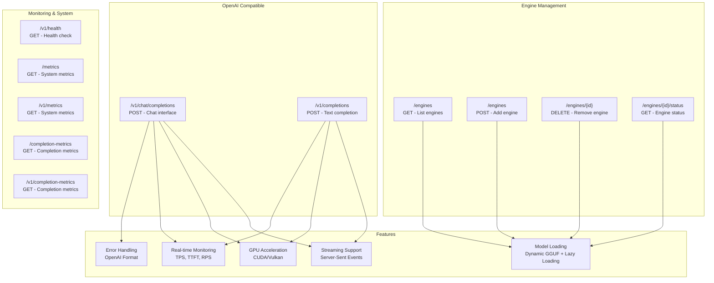

# API Specification

This document provides comprehensive API specifications for the Kolosal Server, detailing all endpoints, request/response formats, and usage examples.

## Base Information

- **Base URL**: `http://localhost:8080`
- **Protocol**: HTTP/1.1
- **Content-Type**: `application/json` (except streaming responses)
- **Authentication**: None (currently)

## API Overview

The Kolosal Server provides OpenAI-compatible endpoints, custom engine management, and comprehensive monitoring:


    B --> K
    C --> K
    D --> K
    E --> K
    F --> K
    G --> K
    
    style A fill:#e3f2fd
    style B fill:#e3f2fd
    style C fill:#e8f5e8
    style D fill:#e8f5e8
    style E fill:#e8f5e8
    style F fill:#e8f5e8
    style G fill:#fff3e0
    style H fill:#f3e5f5
    style I fill:#f3e5f5
    style J fill:#f3e5f5
    style K fill:#f3e5f5
```

## Common Structures

### Error Response Format

All error responses follow this structure:

```json
{
  "error": {
    "message": "string",
    "type": "invalid_request_error" | "server_error" | "not_found_error",
    "param": "string | null",
    "code": "string | null"
  }
}
```

### Usage Statistics

```json
{
  "prompt_tokens": 15,
  "completion_tokens": 28,
  "total_tokens": 43
}
```

## Endpoints

### 1. Chat Completions

**OpenAI-compatible chat completion endpoint**

#### Request

```http
POST /v1/chat/completions
Content-Type: application/json
```

**Request Body**:
```json
{
  "model": "string",                    // Required: Model identifier
  "messages": [                         // Required: Conversation messages
    {
      "role": "system | user | assistant",
      "content": "string"
    }
  ],
  "stream": false,                      // Optional: Enable streaming (default: false)
  "temperature": 1.0,                   // Optional: Sampling temperature 0.0-2.0 (default: 1.0)
  "top_p": 1.0,                        // Optional: Nucleus sampling 0.0-1.0 (default: 1.0)
  "max_tokens": 128,                   // Optional: Maximum tokens to generate (default: 128)
  "seed": null,                        // Optional: Random seed for reproducibility
  "presence_penalty": 0.0,             // Optional: Presence penalty -2.0 to 2.0 (default: 0.0)
  "frequency_penalty": 0.0             // Optional: Frequency penalty -2.0 to 2.0 (default: 0.0)
}
```

**Message Object**:
```json
{
  "role": "system | user | assistant",  // Message role
  "content": "string"                   // Message content
}
```

#### Response (Non-Streaming)

```json
{
  "id": "chatcmpl-80HTkM01z7aaaThFbuALkbTu",
  "object": "chat.completion",
  "created": 1749981228,
  "model": "my-model",
  "system_fingerprint": "fp_4d29efe704",
  "choices": [
    {
      "index": 0,
      "message": {
        "role": "assistant",
        "content": "Hello! I'm doing well, thank you for asking. How can I help you today?"
      },
      "finish_reason": "stop"
    }
  ],
  "usage": {
    "prompt_tokens": 9,
    "completion_tokens": 15,
    "total_tokens": 24
  }
}
```

#### Response (Streaming)

```http
Content-Type: text/event-stream
Cache-Control: no-cache
Connection: keep-alive
```

**Stream Format**:
```
data: {"choices":[{"delta":{"role":"assistant","content":""},"finish_reason":null,"index":0}],"created":1749981242,"id":"chatcmpl-1749981241-1","model":"my-model","object":"chat.completion.chunk","system_fingerprint":"fp_4d29efe704"}

data: {"choices":[{"delta":{"content":"Hello"},"finish_reason":null,"index":0}],"created":1749981242,"id":"chatcmpl-1749981241-1","model":"my-model","object":"chat.completion.chunk","system_fingerprint":"fp_4d29efe704"}

data: {"choices":[{"delta":{"content":" there"},"finish_reason":null,"index":0}],"created":1749981242,"id":"chatcmpl-1749981241-1","model":"my-model","object":"chat.completion.chunk","system_fingerprint":"fp_4d29efe704"}

data: {"choices":[{"delta":{"content":""},"finish_reason":"stop","index":0}],"created":1749981242,"id":"chatcmpl-1749981241-1","model":"my-model","object":"chat.completion.chunk","system_fingerprint":"fp_4d29efe704"}

data: [DONE]
```

**Delta Object** (Streaming):
```json
{
  "role": "assistant",     // Only in first chunk
  "content": "string"      // Incremental content
}
```

#### Examples

**Basic Chat**:
```bash
curl -X POST http://localhost:8080/v1/chat/completions \
  -H "Content-Type: application/json" \
  -d '{
    "model": "my-model",
    "messages": [
      {"role": "user", "content": "Hello, how are you?"}
    ],
    "max_tokens": 100
  }'
```

**System Prompt + Conversation**:
```bash
curl -X POST http://localhost:8080/v1/chat/completions \
  -H "Content-Type: application/json" \
  -d '{
    "model": "my-model",
    "messages": [
      {"role": "system", "content": "You are a helpful assistant."},
      {"role": "user", "content": "What is the capital of France?"},
      {"role": "assistant", "content": "The capital of France is Paris."},
      {"role": "user", "content": "What about Germany?"}
    ],
    "temperature": 0.7,
    "max_tokens": 50
  }'
```

**Streaming Chat**:
```bash
curl -X POST http://localhost:8080/v1/chat/completions \
  -H "Content-Type: application/json" \
  -H "Accept: text/event-stream" \
  -d '{
    "model": "my-model",
    "messages": [
      {"role": "user", "content": "Tell me a story"}
    ],
    "stream": true,
    "max_tokens": 200
  }'
```

### 2. Text Completions

**OpenAI-compatible text completion endpoint**

#### Request

```http
POST /v1/completions
Content-Type: application/json
```

**Request Body**:
```json
{
  "model": "string",                    // Required: Model identifier
  "prompt": "string | array",           // Required: Text prompt or array of prompts
  "stream": false,                      // Optional: Enable streaming (default: false)
  "temperature": 1.0,                   // Optional: Sampling temperature 0.0-2.0 (default: 1.0)
  "top_p": 1.0,                        // Optional: Nucleus sampling 0.0-1.0 (default: 1.0)
  "max_tokens": 16,                    // Optional: Maximum tokens to generate (default: 16)
  "seed": null,                        // Optional: Random seed for reproducibility
  "presence_penalty": 0.0,             // Optional: Presence penalty -2.0 to 2.0 (default: 0.0)
  "frequency_penalty": 0.0             // Optional: Frequency penalty -2.0 to 2.0 (default: 0.0)
}
```

#### Response (Non-Streaming)

```json
{
  "id": "cmpl-80HTkM01z7aaaThFbuALkbTu",
  "object": "text_completion",
  "created": 1749981288,
  "model": "my-model",
  "choices": [
    {
      "index": 0,
      "text": " bright and full of possibilities. As we continue to advance in machine learning...",
      "finish_reason": "stop"
    }
  ],
  "usage": {
    "prompt_tokens": 8,
    "completion_tokens": 25,
    "total_tokens": 33
  }
}
```

#### Response (Streaming)

```http
Content-Type: text/event-stream
```

```
data: {"choices":[{"index":0,"text":"","finish_reason":""}],"created":1749981290,"id":"cmpl-1749981289-1","model":"my-model","object":"text_completion"}

data: {"choices":[{"index":0,"text":" bright","finish_reason":""}],"created":1749981290,"id":"cmpl-1749981289-1","model":"my-model","object":"text_completion"}

data: {"choices":[{"index":0,"text":" and","finish_reason":""}],"created":1749981290,"id":"cmpl-1749981289-1","model":"my-model","object":"text_completion"}

data: {"choices":[{"index":0,"text":"","finish_reason":"stop"}],"created":1749981290,"id":"cmpl-1749981289-1","model":"my-model","object":"text_completion"}

data: [DONE]
```

#### Examples

**Single Prompt**:
```bash
curl -X POST http://localhost:8080/v1/completions \
  -H "Content-Type: application/json" \
  -d '{
    "model": "my-model",
    "prompt": "The future of artificial intelligence is",
    "max_tokens": 100,
    "temperature": 0.7
  }'
```

**Multiple Prompts**:
```bash
curl -X POST http://localhost:8080/v1/completions \
  -H "Content-Type: application/json" \
  -d '{
    "model": "my-model",
    "prompt": [
      "The weather today is",
      "In breaking news,"
    ],
    "max_tokens": 50
  }'
```

### 3. Engine Management

#### Add Engine

```http
POST /engines
Content-Type: application/json
```

**Request Body**:
```json
{
  "engine_id": "string",               // Required: Unique engine identifier
  "model_path": "string",              // Required: Path to GGUF model file
  "n_ctx": 4096,                      // Optional: Context window size (default: 4096)
  "n_gpu_layers": 100,                // Optional: GPU layers to offload (default: 100)
  "main_gpu_id": 0                    // Optional: Primary GPU device ID (default: 0)
}
```

**Response**:
```json
{
  "engine_id": "my-model",
  "status": "loaded",
  "model_path": "/path/to/model.gguf",
  "parameters": {
    "n_ctx": 4096,
    "n_gpu_layers": 100,
    "main_gpu_id": 0
  }
}
```

**Example**:
```bash
curl -X POST http://localhost:8080/engines \
  -H "Content-Type: application/json" \
  -d '{
    "engine_id": "llama-7b",
    "model_path": "/models/llama-7b-q4.gguf",
    "n_ctx": 2048,
    "n_gpu_layers": 32
  }'
```

#### List Engines

```http
GET /engines
```

**Response**:
```json
{
  "engines": [
    {
      "engine_id": "llama-7b",
      "status": "loaded",
      "model_path": "/models/llama-7b-q4.gguf"
    },
    {
      "engine_id": "codellama-13b",
      "status": "unloaded",
      "model_path": "/models/codellama-13b-q4.gguf"
    }
  ]
}
```

#### Remove Engine

```http
DELETE /engines/{engine_id}
```

**Response**:
```json
{
  "engine_id": "my-model",
  "status": "removed"
}
```

**Example**:
```bash
curl -X DELETE http://localhost:8080/engines/llama-7b
```

#### Engine Status

```http
GET /engines/{engine_id}/status
```

**Response**:
```json
{
  "engine_id": "my-model",
  "status": "loaded",
  "model_path": "/models/model.gguf",
  "parameters": {
    "n_ctx": 4096,
    "n_gpu_layers": 100,
    "main_gpu_id": 0
  },
  "memory_usage": {
    "model_size_mb": 3584,
    "context_size_mb": 128
  },
  "performance": {
    "last_inference_tps": 42.5,
    "total_requests": 157
  }
}
```

### 4. Health Check

```http
GET /v1/health
```

**Alternative endpoints**: `/health`, `/status`

**Response**:
```json
{
  "status": "healthy",
  "timestamp": 1749981228,
  "version": "1.0.0",
  "engines": {
    "loaded": 2,
    "unloaded": 1,
    "total": 3
  },
  "system": {
    "uptime_seconds": 3600,
    "memory_usage_mb": 8192,
    "cpu_usage_percent": 15.2
  },
  "engines_summary": [
    {
      "engine_id": "llama-7b",
      "status": "loaded"
    },
    {
      "engine_id": "codellama-13b",
      "status": "unloaded"
    }
  ]
}
```

## HTTP Status Codes

### Success Codes

| Code | Description | Usage |
|------|-------------|-------|
| 200 | OK | Successful request processing |
| 201 | Created | Engine successfully loaded |

### Client Error Codes

| Code | Description | Common Causes |
|------|-------------|---------------|
| 400 | Bad Request | Invalid JSON, missing required fields, invalid parameters |
| 404 | Not Found | Unknown endpoint, engine not found |
| 405 | Method Not Allowed | Incorrect HTTP method for endpoint |

### Server Error Codes

| Code | Description | Common Causes |
|------|-------------|---------------|
| 500 | Internal Server Error | Inference failure, system error, model loading failure |
| 503 | Service Unavailable | Engine loading in progress, resource exhaustion |

## Request/Response Headers

### Common Request Headers

```http
Content-Type: application/json
Accept: application/json
Accept: text/event-stream  # For streaming responses
```

### Common Response Headers

```http
Content-Type: application/json
Content-Type: text/event-stream  # For streaming responses
Cache-Control: no-cache          # For streaming responses
Connection: keep-alive           # For streaming responses
```

## Parameter Reference

### Chat Completion Parameters

| Parameter | Type | Range | Default | Description |
|-----------|------|-------|---------|-------------|
| `model` | string | - | required | Model identifier (engine ID) |
| `messages` | array | - | required | Array of message objects |
| `stream` | boolean | - | false | Enable streaming response |
| `temperature` | number | 0.0-2.0 | 1.0 | Sampling temperature (higher = more random) |
| `top_p` | number | 0.0-1.0 | 1.0 | Nucleus sampling threshold |
| `max_tokens` | integer | 1-∞ | 128 | Maximum tokens to generate |
| `seed` | integer | - | random | Random seed for reproducibility |
| `presence_penalty` | number | -2.0-2.0 | 0.0 | Penalty for new topics |
| `frequency_penalty` | number | -2.0-2.0 | 0.0 | Penalty for repeated tokens |

### Completion Parameters

| Parameter | Type | Range | Default | Description |
|-----------|------|-------|---------|-------------|
| `model` | string | - | required | Model identifier (engine ID) |
| `prompt` | string/array | - | required | Text prompt or array of prompts |
| `stream` | boolean | - | false | Enable streaming response |
| `temperature` | number | 0.0-2.0 | 1.0 | Sampling temperature |
| `top_p` | number | 0.0-1.0 | 1.0 | Nucleus sampling threshold |
| `max_tokens` | integer | 1-∞ | 16 | Maximum tokens to generate |
| `seed` | integer | - | random | Random seed for reproducibility |
| `presence_penalty` | number | -2.0-2.0 | 0.0 | Penalty for new topics |
| `frequency_penalty` | number | -2.0-2.0 | 0.0 | Penalty for repeated tokens |

### Engine Loading Parameters

| Parameter | Type | Range | Default | Description |
|-----------|------|-------|---------|-------------|
| `engine_id` | string | - | required | Unique identifier for the engine |
| `model_path` | string | - | required | Path to GGUF model file |
| `n_ctx` | integer | 128-∞ | 4096 | Context window size (tokens) |
| `n_gpu_layers` | integer | 0-∞ | 100 | Number of layers to offload to GPU |
| `main_gpu_id` | integer | 0-∞ | 0 | Primary GPU device ID |

## Error Examples

### 400 Bad Request

```json
{
  "error": {
    "message": "Missing required parameter 'model'",
    "type": "invalid_request_error",
    "param": "model",
    "code": null
  }
}
```

### 404 Not Found

```json
{
  "error": {
    "message": "Model 'non-existent-model' not found or could not be loaded",
    "type": "not_found_error",
    "param": "model",
    "code": null
  }
}
```

### 500 Internal Server Error

```json
{
  "error": {
    "message": "Inference engine error: CUDA out of memory",
    "type": "server_error",
    "param": null,
    "code": "inference_error"
  }
}
```

## PowerShell Examples

### Chat Completion

```powershell
$body = @{
    model = "my-model"
    messages = @(
        @{
            role = "system"
            content = "You are a helpful assistant."
        },
        @{
            role = "user"
            content = "What is machine learning?"
        }
    )
    max_tokens = 150
    temperature = 0.7
} | ConvertTo-Json -Depth 3

$response = Invoke-RestMethod -Uri "http://localhost:8080/v1/chat/completions" `
                              -Method POST `
                              -Body $body `
                              -ContentType "application/json"

Write-Output $response.choices[0].message.content
```

### Add Engine

```powershell
$body = @{
    engine_id = "llama-7b"
    model_path = "C:\models\llama-7b-q4.gguf"
    n_ctx = 2048
    n_gpu_layers = 32
} | ConvertTo-Json

Invoke-RestMethod -Uri "http://localhost:8080/engines" `
                  -Method POST `
                  -Body $body `
                  -ContentType "application/json"
```

### Health Check

**Endpoint**: `GET /v1/health`

**Description**: Returns server health status and loaded engines.

**Response**:
```json
{
  "status": "ok",
  "timestamp": "2025-06-16T14:30:00Z",
  "engines": {
    "loaded": 2,
    "total": 3
  }
}
```

**PowerShell Example**:
```powershell
$health = Invoke-RestMethod -Uri "http://localhost:8080/v1/health" -Method GET
Write-Output "Server Status: $($health.status)"
Write-Output "Loaded Engines: $($health.engines.loaded)"
```

### System Metrics

**Endpoints**: 
- `GET /metrics`
- `GET /v1/metrics`
- `GET /system/metrics`

**Description**: Returns real-time system resource metrics including CPU, memory, and GPU utilization.

**Response**:
```json
{
  "timestamp": "2025-06-16T06:22:02.238Z",
  "cpu": {
    "usage_percent": 12.26
  },
  "memory": {
    "total_bytes": 8295342080,
    "used_bytes": 7390986240,
    "free_bytes": 904355840,
    "utilization_percent": 89.1,
    "total_formatted": "7.73 GB",
    "used_formatted": "6.88 GB",
    "free_formatted": "862.46 MB"
  },
  "gpus": [
    {
      "id": 0,
      "name": "NVIDIA GeForce RTX 4090",
      "utilization": {
        "gpu_percent": 85.5,
        "memory_percent": 67.8
      },
      "memory": {
        "total_bytes": 25769803776,
        "used_bytes": 17476714496,
        "free_bytes": 8293089280,
        "total_formatted": "24.00 GB",
        "used_formatted": "16.28 GB",
        "free_formatted": "7.72 GB"
      },
      "temperature_celsius": 72.0,
      "power_usage_watts": 350.5,
      "driver_version": "555.99"
    }
  ],
  "summary": {
    "cpu_usage_percent": 12.26,
    "ram_utilization_percent": 89.1,
    "gpu_count": 1,
    "average_gpu_utilization_percent": 85.5,
    "average_vram_utilization_percent": 67.8
  },
  "gpu_monitoring_available": true,
  "metadata": {
    "version": "1.0",
    "server": "kolosal-server",
    "monitoring_capabilities": {
      "cpu": true,
      "memory": true,
      "gpu": true
    }
  }
}
```

**PowerShell Example**:
```powershell
$metrics = Invoke-RestMethod -Uri "http://localhost:8080/metrics" -Method GET
Write-Output "CPU Usage: $($metrics.summary.cpu_usage_percent)%"
Write-Output "RAM Usage: $($metrics.summary.ram_utilization_percent)%"
Write-Output "GPU Count: $($metrics.summary.gpu_count)"
```

### Completion Metrics

**Endpoints**:
- `GET /completion-metrics`
- `GET /v1/completion-metrics`
- `GET /completion/metrics`

**Description**: Returns real-time completion performance metrics including TPS, TTFT, RPS, and success rates.

**Response**:
```json
{
  "completion_metrics": {
    "summary": {
      "total_requests": 150,
      "completed_requests": 147,
      "failed_requests": 3,
      "success_rate_percent": 98.0,
      "total_input_tokens": 1250,
      "total_output_tokens": 3500,
      "avg_turnaround_time_ms": 1450.5,
      "avg_tps": 15.2,
      "avg_output_tps": 9.8,
      "avg_ttft_ms": 325.7,
      "avg_rps": 0.92
    },
    "per_engine": [
      {
        "model_name": "my-model-7b",
        "engine_id": "default",
        "total_requests": 100,
        "completed_requests": 98,
        "failed_requests": 2,
        "total_input_tokens": 800,
        "total_output_tokens": 2400,
        "tps": 16.5,
        "output_tps": 10.2,
        "avg_ttft": 280.3,
        "rps": 1.05,
        "last_updated": "2025-06-16T17:04:12.123Z"
      }
    ],
    "timestamp": "2025-06-16T17:04:12.123Z"
  }
}
```

**Field Descriptions**:
- `total_requests`: Total completion requests received
- `completed_requests`: Successfully completed requests
- `failed_requests`: Requests that failed with errors
- `success_rate_percent`: Success rate (0-100%)
- `total_input_tokens`: Total input tokens processed
- `total_output_tokens`: Total output tokens generated
- `avg_turnaround_time_ms`: Average request completion time
- `avg_tps`: Average tokens per second (input + output)
- `avg_output_tps`: Average output tokens per second
- `avg_ttft_ms`: Average time to first token
- `avg_rps`: Average requests per second

**PowerShell Example**:
```powershell
$metrics = Invoke-RestMethod -Uri "http://localhost:8080/completion-metrics" -Method GET
$summary = $metrics.completion_metrics.summary
Write-Output "Success Rate: $($summary.success_rate_percent)%"
Write-Output "Avg TPS: $($summary.avg_tps)"
Write-Output "Avg TTFT: $($summary.avg_ttft_ms)ms"
```

## Rate Limiting and Quotas

**Current Status**: No rate limiting implemented

**Recommendations for Production**:
- Implement per-client rate limiting
- Add request quotas
- Monitor resource usage
- Implement backpressure mechanisms

## Versioning

**Current Version**: v1

**API Versioning Strategy**:
- Major version in URL path (`/v1/`)
- Backward compatibility within major versions
- Deprecation notices for breaking changes

## OpenAI Compatibility

This API maintains compatibility with OpenAI's API format for:

- Request/response structure
- Parameter names and types
- Error response format
- Streaming protocol (Server-Sent Events)

**Differences from OpenAI**:
- No authentication required
- Additional engine management endpoints
- Extended health check information
- Custom error codes for inference-specific issues
