# API Specification

This document provides comprehensive API specifications for the Kolosal Server, detailing all endpoints, request/response formats, and usage examples.

## Base Information

- **Base URL**: `http://localhost:8080`
- **Protocol**: HTTP/1.1
- **Content-Type**: `application/json` (except streaming responses)
- **Authentication**: None (currently)

## API Overview

The Kolosal Server provides both OpenAI-compatible and custom endpoints:

```mermaid
graph TD
    subgraph "OpenAI Compatible"
        A["/v1/chat/completions<br/>POST - Chat interface"]
        B["/v1/completions<br/>POST - Text completion"]
    end
      subgraph "Engine Management"
        C["/engines<br/>GET - List engines"]
        D["/engines<br/>POST - Add engine"]
        E["/engines/{id}<br/>DELETE - Remove engine"]
        F["/engines/{id}/status<br/>GET - Engine status"]
    end
    
    subgraph "Agent System"
        AA["/api/v1/agents<br/>GET/POST - Agent management"]
        BB["/api/v1/agents/{id}/execute<br/>POST - Function execution"]
        CC["/api/v1/orchestration/workflows<br/>POST - Workflow creation"]
        DD["/api/v1/agents/messages/send<br/>POST - Agent communication"]
        EE["/v1/agents/{id}/chat/completions<br/>POST - OpenAI compatible"]
    end
    
    subgraph "System"
        G["/v1/health<br/>GET - Health check"]
        GG["/api/v1/agents/system/status<br/>GET - Agent system status"]
        HH["/api/v1/orchestration/metrics<br/>GET - Orchestration metrics"]
    end
      subgraph "Features"
        H["Streaming Support<br/>Server-Sent Events"]
        I["GPU Acceleration<br/>CUDA/Vulkan"]
        J["Model Loading<br/>Dynamic GGUF"]
        K["Error Handling<br/>OpenAI Format"]
        L["Multi-Agent System<br/>Orchestration & Collaboration"]
        M["Hot-Reloading<br/>Dynamic Configuration"]
    end
    
    A --> H
    B --> H
    A --> I
    B --> I
    C --> J
    D --> J
    E --> J
    F --> J
    AA --> L
    BB --> L
    CC --> L
    DD --> L
    EE --> L
    AA --> M
    GG --> M
    
    A --> K
    B --> K
    C --> K
    D --> K
    E --> K
    F --> K
    G --> K
    AA --> K
    BB --> K
    CC --> K
    DD --> K
    EE --> K
    GG --> K
    HH --> K
      style A fill:#e3f2fd
    style B fill:#e3f2fd
    style C fill:#e8f5e8
    style D fill:#e8f5e8
    style E fill:#e8f5e8
    style F fill:#e8f5e8
    style G fill:#fff3e0
    style AA fill:#e1f5fe
    style BB fill:#e1f5fe
    style CC fill:#e1f5fe
    style DD fill:#e1f5fe
    style EE fill:#e1f5fe
    style GG fill:#fff3e0
    style HH fill:#fff3e0
    style H fill:#f3e5f5
    style I fill:#f3e5f5
    style J fill:#f3e5f5
    style K fill:#f3e5f5
    style L fill:#f3e5f5
    style M fill:#f3e5f5
```



## Common Structures

### Error Response Format

All error responses follow this structure:

```json
{
  "error": {
    "message": "string",
    "type": "invalid_request_error" | "server_error" | "not_found_error",
    "param": "string | null",
    "code": "string | null"
  }
}
```

### Usage Statistics

```json
{
  "prompt_tokens": 15,
  "completion_tokens": 28,
  "total_tokens": 43
}
```

## Endpoints

### 1. Chat Completions

**OpenAI-compatible chat completion endpoint**

#### Request

```http
POST /v1/chat/completions
Content-Type: application/json
```

**Request Body**:
```json
{
  "model": "string",                    // Required: Model identifier
  "messages": [                         // Required: Conversation messages
    {
      "role": "system | user | assistant",
      "content": "string"
    }
  ],
  "stream": false,                      // Optional: Enable streaming (default: false)
  "temperature": 1.0,                   // Optional: Sampling temperature 0.0-2.0 (default: 1.0)
  "top_p": 1.0,                        // Optional: Nucleus sampling 0.0-1.0 (default: 1.0)
  "max_tokens": 128,                   // Optional: Maximum tokens to generate (default: 128)
  "seed": null,                        // Optional: Random seed for reproducibility
  "presence_penalty": 0.0,             // Optional: Presence penalty -2.0 to 2.0 (default: 0.0)
  "frequency_penalty": 0.0             // Optional: Frequency penalty -2.0 to 2.0 (default: 0.0)
}
```

**Message Object**:
```json
{
  "role": "system | user | assistant",  // Message role
  "content": "string"                   // Message content
}
```

#### Response (Non-Streaming)

```json
{
  "id": "chatcmpl-80HTkM01z7aaaThFbuALkbTu",
  "object": "chat.completion",
  "created": 1749981228,
  "model": "my-model",
  "system_fingerprint": "fp_4d29efe704",
  "choices": [
    {
      "index": 0,
      "message": {
        "role": "assistant",
        "content": "Hello! I'm doing well, thank you for asking. How can I help you today?"
      },
      "finish_reason": "stop"
    }
  ],
  "usage": {
    "prompt_tokens": 9,
    "completion_tokens": 15,
    "total_tokens": 24
  }
}
```

#### Response (Streaming)

```http
Content-Type: text/event-stream
Cache-Control: no-cache
Connection: keep-alive
```

**Stream Format**:
```
data: {"choices":[{"delta":{"role":"assistant","content":""},"finish_reason":null,"index":0}],"created":1749981242,"id":"chatcmpl-1749981241-1","model":"my-model","object":"chat.completion.chunk","system_fingerprint":"fp_4d29efe704"}

data: {"choices":[{"delta":{"content":"Hello"},"finish_reason":null,"index":0}],"created":1749981242,"id":"chatcmpl-1749981241-1","model":"my-model","object":"chat.completion.chunk","system_fingerprint":"fp_4d29efe704"}

data: {"choices":[{"delta":{"content":" there"},"finish_reason":null,"index":0}],"created":1749981242,"id":"chatcmpl-1749981241-1","model":"my-model","object":"chat.completion.chunk","system_fingerprint":"fp_4d29efe704"}

data: {"choices":[{"delta":{"content":""},"finish_reason":"stop","index":0}],"created":1749981242,"id":"chatcmpl-1749981241-1","model":"my-model","object":"chat.completion.chunk","system_fingerprint":"fp_4d29efe704"}

data: [DONE]
```

**Delta Object** (Streaming):
```json
{
  "role": "assistant",     // Only in first chunk
  "content": "string"      // Incremental content
}
```

#### Examples

**Basic Chat**:
```bash
curl -X POST http://localhost:8080/v1/chat/completions \
  -H "Content-Type: application/json" \
  -d '{
    "model": "my-model",
    "messages": [
      {"role": "user", "content": "Hello, how are you?"}
    ],
    "max_tokens": 100
  }'
```

**System Prompt + Conversation**:
```bash
curl -X POST http://localhost:8080/v1/chat/completions \
  -H "Content-Type: application/json" \
  -d '{
    "model": "my-model",
    "messages": [
      {"role": "system", "content": "You are a helpful assistant."},
      {"role": "user", "content": "What is the capital of France?"},
      {"role": "assistant", "content": "The capital of France is Paris."},
      {"role": "user", "content": "What about Germany?"}
    ],
    "temperature": 0.7,
    "max_tokens": 50
  }'
```

**Streaming Chat**:
```bash
curl -X POST http://localhost:8080/v1/chat/completions \
  -H "Content-Type: application/json" \
  -H "Accept: text/event-stream" \
  -d '{
    "model": "my-model",
    "messages": [
      {"role": "user", "content": "Tell me a story"}
    ],
    "stream": true,
    "max_tokens": 200
  }'
```

### 2. Text Completions

**OpenAI-compatible text completion endpoint**

#### Request

```http
POST /v1/completions
Content-Type: application/json
```

**Request Body**:
```json
{
  "model": "string",                    // Required: Model identifier
  "prompt": "string | array",           // Required: Text prompt or array of prompts
  "stream": false,                      // Optional: Enable streaming (default: false)
  "temperature": 1.0,                   // Optional: Sampling temperature 0.0-2.0 (default: 1.0)
  "top_p": 1.0,                        // Optional: Nucleus sampling 0.0-1.0 (default: 1.0)
  "max_tokens": 16,                    // Optional: Maximum tokens to generate (default: 16)
  "seed": null,                        // Optional: Random seed for reproducibility
  "presence_penalty": 0.0,             // Optional: Presence penalty -2.0 to 2.0 (default: 0.0)
  "frequency_penalty": 0.0             // Optional: Frequency penalty -2.0 to 2.0 (default: 0.0)
}
```

#### Response (Non-Streaming)

```json
{
  "id": "cmpl-80HTkM01z7aaaThFbuALkbTu",
  "object": "text_completion",
  "created": 1749981288,
  "model": "my-model",
  "choices": [
    {
      "index": 0,
      "text": " bright and full of possibilities. As we continue to advance in machine learning...",
      "finish_reason": "stop"
    }
  ],
  "usage": {
    "prompt_tokens": 8,
    "completion_tokens": 25,
    "total_tokens": 33
  }
}
```

#### Response (Streaming)

```http
Content-Type: text/event-stream
```

```
data: {"choices":[{"index":0,"text":"","finish_reason":""}],"created":1749981290,"id":"cmpl-1749981289-1","model":"my-model","object":"text_completion"}

data: {"choices":[{"index":0,"text":" bright","finish_reason":""}],"created":1749981290,"id":"cmpl-1749981289-1","model":"my-model","object":"text_completion"}

data: {"choices":[{"index":0,"text":" and","finish_reason":""}],"created":1749981290,"id":"cmpl-1749981289-1","model":"my-model","object":"text_completion"}

data: {"choices":[{"index":0,"text":"","finish_reason":"stop"}],"created":1749981290,"id":"cmpl-1749981289-1","model":"my-model","object":"text_completion"}

data: [DONE]
```

#### Examples

**Single Prompt**:
```bash
curl -X POST http://localhost:8080/v1/completions \
  -H "Content-Type: application/json" \
  -d '{
    "model": "my-model",
    "prompt": "The future of artificial intelligence is",
    "max_tokens": 100,
    "temperature": 0.7
  }'
```

**Multiple Prompts**:
```bash
curl -X POST http://localhost:8080/v1/completions \
  -H "Content-Type: application/json" \
  -d '{
    "model": "my-model",
    "prompt": [
      "The weather today is",
      "In breaking news,"
    ],
    "max_tokens": 50
  }'
```

### 3. Engine Management

#### Add Engine

```http
POST /engines
Content-Type: application/json
```

**Request Body**:
```json
{
  "engine_id": "string",               // Required: Unique engine identifier
  "model_path": "string",              // Required: Path to GGUF model file
  "n_ctx": 4096,                      // Optional: Context window size (default: 4096)
  "n_gpu_layers": 100,                // Optional: GPU layers to offload (default: 100)
  "main_gpu_id": 0                    // Optional: Primary GPU device ID (default: 0)
}
```

**Response**:
```json
{
  "engine_id": "my-model",
  "status": "loaded",
  "model_path": "/path/to/model.gguf",
  "parameters": {
    "n_ctx": 4096,
    "n_gpu_layers": 100,
    "main_gpu_id": 0
  }
}
```

**Example**:
```bash
curl -X POST http://localhost:8080/engines \
  -H "Content-Type: application/json" \
  -d '{
    "engine_id": "llama-7b",
    "model_path": "/models/llama-7b-q4.gguf",
    "n_ctx": 2048,
    "n_gpu_layers": 32
  }'
```

#### List Engines

```http
GET /engines
```

**Response**:
```json
{
  "engines": [
    {
      "engine_id": "llama-7b",
      "status": "loaded",
      "model_path": "/models/llama-7b-q4.gguf"
    },
    {
      "engine_id": "codellama-13b",
      "status": "unloaded",
      "model_path": "/models/codellama-13b-q4.gguf"
    }
  ]
}
```

#### Remove Engine

```http
DELETE /engines/{engine_id}
```

**Response**:
```json
{
  "engine_id": "my-model",
  "status": "removed"
}
```

**Example**:
```bash
curl -X DELETE http://localhost:8080/engines/llama-7b
```

#### Engine Status

```http
GET /engines/{engine_id}/status
```

**Response**:
```json
{
  "engine_id": "my-model",
  "status": "loaded",
  "model_path": "/models/model.gguf",
  "parameters": {
    "n_ctx": 4096,
    "n_gpu_layers": 100,
    "main_gpu_id": 0
  },
  "memory_usage": {
    "model_size_mb": 3584,
    "context_size_mb": 128
  },
  "performance": {
    "last_inference_tps": 42.5,
    "total_requests": 157
  }
}
```

### 4. Health Check

```http
GET /v1/health
```

**Alternative endpoints**: `/health`, `/status`

**Response**:
```json
{
  "status": "healthy",
  "timestamp": 1749981228,
  "version": "1.0.0",
  "engines": {
    "loaded": 2,
    "unloaded": 1,
    "total": 3
  },
  "agents": {
    "running": 5,
    "stopped": 1,
    "total": 6
  },
  "system": {
    "uptime_seconds": 3600,
    "memory_usage_mb": 8192,
    "cpu_usage_percent": 15.2
  },
  "engines_summary": [
    {
      "engine_id": "llama-7b",
      "status": "loaded"
    },
    {
      "engine_id": "codellama-13b",
      "status": "unloaded"
    }
  ],
  "agents_summary": [
    {
      "agent_id": "research_assistant",
      "status": "running",
      "type": "research"
    },
    {
      "agent_id": "code_assistant",
      "status": "running",
      "type": "development"
    }
  ]
}
```

## HTTP Status Codes

### Success Codes

| Code | Description | Usage |
|------|-------------|-------|
| 200 | OK | Successful request processing |
| 201 | Created | Engine successfully loaded |

### Client Error Codes

| Code | Description | Common Causes |
|------|-------------|---------------|
| 400 | Bad Request | Invalid JSON, missing required fields, invalid parameters |
| 404 | Not Found | Unknown endpoint, engine not found |
| 405 | Method Not Allowed | Incorrect HTTP method for endpoint |

### Server Error Codes

| Code | Description | Common Causes |
|------|-------------|---------------|
| 500 | Internal Server Error | Inference failure, system error, model loading failure |
| 503 | Service Unavailable | Engine loading in progress, resource exhaustion |

## Request/Response Headers

### Common Request Headers

```http
Content-Type: application/json
Accept: application/json
Accept: text/event-stream  # For streaming responses
```

### Common Response Headers

```http
Content-Type: application/json
Content-Type: text/event-stream  # For streaming responses
Cache-Control: no-cache          # For streaming responses
Connection: keep-alive           # For streaming responses
```

## Parameter Reference

### Chat Completion Parameters

| Parameter | Type | Range | Default | Description |
|-----------|------|-------|---------|-------------|
| `model` | string | - | required | Model identifier (engine ID) |
| `messages` | array | - | required | Array of message objects |
| `stream` | boolean | - | false | Enable streaming response |
| `temperature` | number | 0.0-2.0 | 1.0 | Sampling temperature (higher = more random) |
| `top_p` | number | 0.0-1.0 | 1.0 | Nucleus sampling threshold |
| `max_tokens` | integer | 1-∞ | 128 | Maximum tokens to generate |
| `seed` | integer | - | random | Random seed for reproducibility |
| `presence_penalty` | number | -2.0-2.0 | 0.0 | Penalty for new topics |
| `frequency_penalty` | number | -2.0-2.0 | 0.0 | Penalty for repeated tokens |

### Completion Parameters

| Parameter | Type | Range | Default | Description |
|-----------|------|-------|---------|-------------|
| `model` | string | - | required | Model identifier (engine ID) |
| `prompt` | string/array | - | required | Text prompt or array of prompts |
| `stream` | boolean | - | false | Enable streaming response |
| `temperature` | number | 0.0-2.0 | 1.0 | Sampling temperature |
| `top_p` | number | 0.0-1.0 | 1.0 | Nucleus sampling threshold |
| `max_tokens` | integer | 1-∞ | 16 | Maximum tokens to generate |
| `seed` | integer | - | random | Random seed for reproducibility |
| `presence_penalty` | number | -2.0-2.0 | 0.0 | Penalty for new topics |
| `frequency_penalty` | number | -2.0-2.0 | 0.0 | Penalty for repeated tokens |

### Engine Loading Parameters

| Parameter | Type | Range | Default | Description |
|-----------|------|-------|---------|-------------|
| `engine_id` | string | - | required | Unique identifier for the engine |
| `model_path` | string | - | required | Path to GGUF model file |
| `n_ctx` | integer | 128-∞ | 4096 | Context window size (tokens) |
| `n_gpu_layers` | integer | 0-∞ | 100 | Number of layers to offload to GPU |
| `main_gpu_id` | integer | 0-∞ | 0 | Primary GPU device ID |

### Agent System Parameters

| Parameter | Type | Range | Default | Description |
|-----------|------|-------|---------|-------------|
| `name` | string | - | required | Agent name/identifier |
| `type` | string | - | required | Agent type (research, development, analytics, creative, management, quality_assurance) |
| `role` | string | - | optional | Human-readable role description |
| `system_prompt` | string | - | optional | System prompt for the agent |
| `capabilities` | array | - | required | List of agent capabilities |
| `functions` | array | - | required | List of available functions |
| `auto_start` | boolean | - | false | Whether to start agent automatically |
| `max_concurrent_jobs` | integer | 1-∞ | 3 | Maximum concurrent job execution |
| `heartbeat_interval_seconds` | integer | 1-∞ | 10 | Health check interval |

### Workflow Parameters

| Parameter | Type | Range | Default | Description |
|-----------|------|-------|---------|-------------|
| `name` | string | - | required | Workflow name |
| `description` | string | - | optional | Workflow description |
| `global_context` | object | - | optional | Shared context for all steps |
| `steps` | array | - | required | Array of workflow steps |
| `step_id` | string | - | required | Unique step identifier |
| `agent_id` | string | - | required | Agent to execute the step |
| `function_name` | string | - | required | Function to execute |
| `parameters` | object | - | optional | Function parameters |
| `dependencies` | array | - | [] | Array of step IDs this step depends on |
| `parallel_allowed` | boolean | - | true | Whether step can run in parallel |

### Message Parameters

| Parameter | Type | Range | Default | Description |
|-----------|------|-------|---------|-------------|
| `from_agent` | string | - | required | Sender agent ID |
| `to_agent` | string | - | required | Recipient agent ID (for direct messages) |
| `type` | string | - | required | Message type (task_request, status_update, etc.) |
| `payload` | object | - | required | Message content |
| `priority` | integer | 1-5 | 3 | Message priority (1=highest, 5=lowest) |
| `correlation_id` | string | - | optional | Correlation ID for tracking |

## Error Examples

### 400 Bad Request

```json
{
  "error": {
    "message": "Missing required parameter 'model'",
    "type": "invalid_request_error",
    "param": "model",
    "code": null
  }
}
```

### 404 Not Found

```json
{
  "error": {
    "message": "Model 'non-existent-model' not found or could not be loaded",
    "type": "not_found_error",
    "param": "model",
    "code": null
  }
}
```

### 500 Internal Server Error

```json
{
  "error": {
    "message": "Inference engine error: CUDA out of memory",
    "type": "server_error",
    "param": null,
    "code": "inference_error"
  }
}
```

## PowerShell Examples

### Chat Completion

```powershell
$body = @{
    model = "my-model"
    messages = @(
        @{
            role = "system"
            content = "You are a helpful assistant."
        },
        @{
            role = "user"
            content = "What is machine learning?"
        }
    )
    max_tokens = 150
    temperature = 0.7
} | ConvertTo-Json -Depth 3

$response = Invoke-RestMethod -Uri "http://localhost:8080/v1/chat/completions" `
                              -Method POST `
                              -Body $body `
                              -ContentType "application/json"

Write-Output $response.choices[0].message.content
```

### Add Engine

```powershell
$body = @{
    engine_id = "llama-7b"
    model_path = "C:\models\llama-7b-q4.gguf"
    n_ctx = 2048
    n_gpu_layers = 32
} | ConvertTo-Json

Invoke-RestMethod -Uri "http://localhost:8080/engines" `
                  -Method POST `
                  -Body $body `
                  -ContentType "application/json"
```

### Health Check

```powershell
$health = Invoke-RestMethod -Uri "http://localhost:8080/v1/health" -Method GET
Write-Output "Server Status: $($health.status)"
Write-Output "Loaded Engines: $($health.engines.loaded)"
Write-Output "Running Agents: $($health.agents.running)"
```

### Agent System Operations

```powershell
# Create a new agent
$agentBody = @{
    name = "research_agent"
    type = "research"
    role = "Research Assistant"
    capabilities = @("web_search", "text_processing")
    auto_start = $true
} | ConvertTo-Json -Depth 3

$agent = Invoke-RestMethod -Uri "http://localhost:8080/api/v1/agents" `
                           -Method POST `
                           -Body $agentBody `
                           -ContentType "application/json"

# Execute function on agent
$execBody = @{
    function = "text_processing"
    parameters = @{
        text = "Analyze this text for sentiment"
        operation = "analyze"
    }
} | ConvertTo-Json -Depth 3

$result = Invoke-RestMethod -Uri "http://localhost:8080/api/v1/agents/research_agent/execute" `
                            -Method POST `
                            -Body $execBody `
                            -ContentType "application/json"

Write-Output "Execution Result: $($result.data.result)"

# Get agent system status
$agentStatus = Invoke-RestMethod -Uri "http://localhost:8080/api/v1/agents/system/status" -Method GET
Write-Output "Total Agents: $($agentStatus.data.agent_count)"
Write-Output "System Status: $($agentStatus.data.system_status)"

# Create and execute workflow
$workflowBody = @{
    name = "Simple Research Workflow"
    description = "Basic research and analysis"
    steps = @(
        @{
            step_id = "research"
            agent_id = "research_agent"
            function_name = "web_search"
            parameters = @{
                query = "PowerShell automation"
                limit = 5
            }
            dependencies = @()
        }
    )
} | ConvertTo-Json -Depth 4

$workflow = Invoke-RestMethod -Uri "http://localhost:8080/api/v1/orchestration/workflows" `
                              -Method POST `
                              -Body $workflowBody `
                              -ContentType "application/json"

# Execute workflow asynchronously
$workflowExec = Invoke-RestMethod -Uri "http://localhost:8080/api/v1/orchestration/workflows/$($workflow.data.workflow_id)/execute-async" `
                                  -Method POST `
                                  -ContentType "application/json"

Write-Output "Workflow Status: $($workflowExec.data.status)"
```

## Rate Limiting and Quotas

**Current Status**: No rate limiting implemented

**Recommendations for Production**:
- Implement per-client rate limiting
- Add request quotas
- Monitor resource usage
- Implement backpressure mechanisms

## Versioning

**Current Version**: v1

**API Versioning Strategy**:
- Major version in URL path (`/v1/`)
- Backward compatibility within major versions
- Deprecation notices for breaking changes

## OpenAI Compatibility

This API maintains compatibility with OpenAI's API format for:

- Request/response structure
- Parameter names and types
- Error response format
- Streaming protocol (Server-Sent Events)

**OpenAI Compatible Endpoints**:
- `/v1/chat/completions` - Standard chat completions
- `/v1/completions` - Text completions
- `/v1/agents/{agent_id}/chat/completions` - Agent-specific chat completions

**Agent System Extensions**:
- Multi-agent orchestration and workflow management
- Inter-agent communication protocols
- Dynamic agent creation and management
- Advanced function execution with job queuing
- Real-time system monitoring and metrics

**Differences from OpenAI**:
- No authentication required
- Additional engine management endpoints
- Extended health check information
- Custom error codes for inference-specific issues
- Multi-agent system capabilities
- Workflow orchestration features
- Hot-reloading configuration support

## Agent System Endpoints

### 5. Agent Management

#### List All Agents

```http
GET /api/v1/agents
```

**Response**:
```json
{
  "success": true,
  "data": [
    {
      "uuid": "agent_12345_67890",
      "id": "research_assistant",
      "name": "research_assistant",
      "type": "research",
      "capabilities": [
        "web_search",
        "text_processing",
        "data_analysis"
      ],
      "running": true
    }
  ],
  "count": 1
}
```

#### Create New Agent

```http
POST /api/v1/agents
```

**Request Body**:
```json
{
  "name": "custom_agent",
  "type": "research",
  "role": "Research Assistant",
  "system_prompt": "You are a helpful research assistant.",
  "capabilities": [
    "web_search",
    "text_processing",
    "data_analysis"
  ],
  "functions": [
    "inference",
    "web_search",
    "text_processing"
  ],
  "llm_config": {
    "model_name": "test-qwen-0.6b",
    "api_endpoint": "http://localhost:8080/v1",
    "temperature": 0.7,
    "max_tokens": 2048
  },
  "auto_start": true,
  "max_concurrent_jobs": 3
}
```

**Response**:
```json
{
  "success": true,
  "data": {
    "agent_id": "custom_agent_12345",
    "status": "created"
  }
}
```

#### Get Agent Details

```http
GET /api/v1/agents/{agent_id}
```

**Response**:
```json
{
  "success": true,
  "data": {
    "uuid": "agent_12345_67890",
    "id": "research_assistant",
    "name": "research_assistant",
    "type": "research",
    "capabilities": [
      "web_search",
      "text_processing",
      "data_analysis"
    ],
    "running": true,
    "functions": [
      "inference",
      "web_search",
      "text_processing"
    ],
    "max_concurrent_jobs": 3
  }
}
```

#### Agent Control

```http
POST /api/v1/agents/{agent_id}/start
POST /api/v1/agents/{agent_id}/stop
DELETE /api/v1/agents/{agent_id}
```

### 6. Function Execution

#### Execute Function Synchronously

```http
POST /api/v1/agents/{agent_id}/execute
```

**Request Body**:
```json
{
  "function": "text_processing",
  "parameters": {
    "text": "The quick brown fox jumps over the lazy dog",
    "operation": "analyze"
  }
}
```

**Response**:
```json
{
  "success": true,
  "data": {
    "success": true,
    "execution_time_ms": 234.5,
    "result": {
      "word_count": 9,
      "character_count": 43,
      "sentiment": "neutral"
    }
  }
}
```

#### Execute Function Asynchronously

```http
POST /api/v1/agents/{agent_id}/execute-async
```

**Request Body**:
```json
{
  "function": "code_generation",
  "parameters": {
    "requirements": "Create a REST API endpoint",
    "language": "python",
    "framework": "fastapi"
  },
  "priority": 1
}
```

**Response**:
```json
{
  "success": true,
  "data": {
    "job_id": "job_67890",
    "status": "queued",
    "agent_id": "code_assistant",
    "function": "code_generation"
  }
}
```

#### Job Management

```http
GET /api/v1/agents/jobs/{job_id}/status
GET /api/v1/agents/jobs/{job_id}/result
```

### 7. Agent Communication

#### Send Message Between Agents

```http
POST /api/v1/agents/messages/send
```

**Request Body**:
```json
{
  "from_agent": "research_assistant",
  "to_agent": "code_assistant",
  "type": "task_request",
  "payload": {
    "task": "Generate code based on research",
    "data": "Research findings...",
    "priority": "high"
  },
  "correlation_id": "workflow_abc123"
}
```

#### Broadcast Message

```http
POST /api/v1/agents/messages/broadcast
```

**Request Body**:
```json
{
  "from_agent": "project_manager",
  "type": "status_update",
  "payload": {
    "message": "System maintenance scheduled",
    "timestamp": "2025-06-25T02:00:00Z"
  }
}
```

### 8. OpenAI Compatible Agent Endpoints

#### Agent Chat Completions

```http
POST /v1/agents/{agent_id}/chat/completions
```

**Request Body** (OpenAI Format):
```json
{
  "messages": [
    {
      "role": "system",
      "content": "You are a helpful assistant."
    },
    {
      "role": "user",
      "content": "Hello, how are you?"
    }
  ],
  "model": "agent_model",
  "max_tokens": 150,
  "temperature": 0.7
}
```

**Response** (OpenAI Format):
```json
{
  "id": "chatcmpl-123",
  "object": "chat.completion",
  "created": 1677652288,
  "model": "agent_model",
  "choices": [
    {
      "index": 0,
      "message": {
        "role": "assistant",
        "content": "Hello! I'm doing well, thank you for asking."
      },
      "finish_reason": "stop"
    }
  ],
  "usage": {
    "prompt_tokens": 20,
    "completion_tokens": 15,
    "total_tokens": 35
  }
}
```

#### Additional Agent Endpoints

```http
POST /v1/agents/{agent_id}/chat
POST /v1/agents/{agent_id}/message
POST /v1/agents/{agent_id}/generate
POST /v1/agents/{agent_id}/respond
```

### 9. Workflow Orchestration

#### Create Workflow

```http
POST /api/v1/orchestration/workflows
```

**Request Body**:
```json
{
  "name": "Content Creation Workflow",
  "description": "Research, write, and review content",
  "global_context": {
    "topic": "AI in Healthcare",
    "target_audience": "medical professionals"
  },
  "steps": [
    {
      "step_id": "research",
      "agent_id": "research_assistant",
      "function_name": "web_search",
      "parameters": {
        "query": "AI applications in healthcare 2024"
      },
      "dependencies": [],
      "parallel_allowed": true
    },
    {
      "step_id": "write_content",
      "agent_id": "content_creator",
      "function_name": "text_processing", 
      "parameters": {
        "operation": "write_article"
      },
      "dependencies": ["research"],
      "parallel_allowed": false
    }
  ]
}
```

#### Execute Workflow

```http
POST /api/v1/orchestration/workflows/{workflow_id}/execute
POST /api/v1/orchestration/workflows/{workflow_id}/execute-async
```

#### Get Workflow Results

```http
GET /api/v1/orchestration/workflows/{workflow_id}/result
GET /api/v1/orchestration/workflows/{workflow_id}/status
```

### 10. Collaboration Patterns

#### Create Collaboration Group

```http
POST /api/v1/orchestration/collaboration-groups
```

**Request Body**:
```json
{
  "name": "Development Team",
  "pattern": "hierarchy",
  "agent_ids": ["project_manager", "code_assistant", "qa_specialist"],
  "consensus_threshold": 2
}
```

**Collaboration Patterns**:
- `sequential` - Agents work one after another
- `parallel` - Agents work simultaneously  
- `pipeline` - Output feeds into next agent
- `consensus` - Agents vote on best result
- `hierarchy` - Master-slave coordination
- `negotiation` - Agents negotiate agreement

#### Execute Collaboration

```http
POST /api/v1/orchestration/collaboration-groups/{group_id}/execute
```

### 11. System Management & Monitoring

#### Agent System Status

```http
GET /api/v1/agents/system/status
```

**Response**:
```json
{
  "success": true,
  "data": {
    "system_running": true,
    "agent_count": 6,
    "system_status": "All systems operational",
    "agents": [
      {
        "id": "research_assistant",
        "name": "research_assistant",
        "running": true
      }
    ]
  }
}
```

#### System Metrics

```http
GET /api/v1/agents/system/metrics
```

**Response**:
```json
{
  "success": true,
  "data": {
    "total_agents": 6,
    "running_agents": 5,
    "stopped_agents": 1,
    "total_functions_executed": 1247,
    "average_execution_time_ms": 856.3,
    "active_jobs": 4,
    "system_uptime_seconds": 86400,
    "memory_usage_mb": 512,
    "cpu_usage_percent": 23.5
  }
}
```

#### Orchestration Metrics

```http
GET /api/v1/orchestration/metrics
```

**Response**:
```json
{
  "success": true,
  "data": {
    "active_workflows": 3,
    "completed_workflows": 15,
    "failed_workflows": 1,
    "total_workflows": 19,
    "collaboration_groups": 2,
    "orchestrator_status": "running",
    "workflow_execution_times": {
      "average_ms": 2340,
      "min_ms": 450,
      "max_ms": 8920
    }
  }
}
```

#### Orchestrator Status

```http
GET /api/v1/orchestration/status
```

**Response**:
```json
{
  "success": true,
  "data": {
    "status": "running",
    "is_running": true
  }
}
```

#### Configuration Management

```http
POST /api/v1/agents/system/reload
```

**Request Body**:
```json
{
  "config_file": "/path/to/agents.yaml"
}
```

## Agent System Examples

### Basic Agent Operations

```bash
# Create a research agent
curl -X POST http://localhost:8080/api/v1/agents \
  -H "Content-Type: application/json" \
  -d '{
    "name": "research_bot",
    "type": "research",
    "role": "Research Assistant",
    "capabilities": ["web_search", "text_processing"],
    "auto_start": true
  }'

# List all agents
curl http://localhost:8080/api/v1/agents

# Execute a function on the agent
curl -X POST http://localhost:8080/api/v1/agents/research_bot/execute \
  -H "Content-Type: application/json" \
  -d '{
    "function": "web_search",
    "parameters": {
      "query": "latest AI developments",
      "limit": 10
    }
  }'
```

### Multi-Agent Workflow

```bash
# Create multiple specialized agents
curl -X POST http://localhost:8080/api/v1/agents \
  -H "Content-Type: application/json" \
  -d '{
    "name": "researcher",
    "type": "research",
    "capabilities": ["web_search", "text_processing"]
  }'

curl -X POST http://localhost:8080/api/v1/agents \
  -H "Content-Type: application/json" \
  -d '{
    "name": "writer",
    "type": "creative", 
    "capabilities": ["text_processing", "content_creation"]
  }'

# Create a workflow
curl -X POST http://localhost:8080/api/v1/orchestration/workflows \
  -H "Content-Type: application/json" \
  -d '{
    "name": "Research and Write",
    "steps": [
      {
        "step_id": "research",
        "agent_id": "researcher",
        "function_name": "web_search",
        "parameters": {"query": "quantum computing trends"}
      },
      {
        "step_id": "write",
        "agent_id": "writer", 
        "function_name": "text_processing",
        "parameters": {"operation": "write_article"},
        "dependencies": ["research"]
      }
    ]
  }'

# Execute the workflow
curl -X POST http://localhost:8080/api/v1/orchestration/workflows/workflow_123/execute
```

### OpenAI Compatible Agent Usage

```bash
# Use agent as OpenAI-compatible endpoint
curl -X POST http://localhost:8080/v1/agents/research_bot/chat/completions \
  -H "Content-Type: application/json" \
  -d '{
    "messages": [
      {"role": "user", "content": "Explain quantum computing"}
    ],
    "max_tokens": 200,
    "temperature": 0.7
  }'
```

### System Monitoring

```bash
# Check agent system status
curl http://localhost:8080/api/v1/agents/system/status

# Get system metrics
curl http://localhost:8080/api/v1/agents/system/metrics

# Get orchestration metrics
curl http://localhost:8080/api/v1/orchestration/metrics
```
