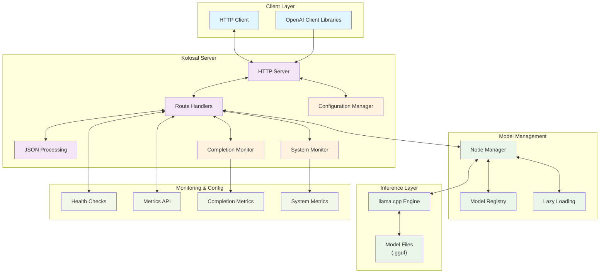
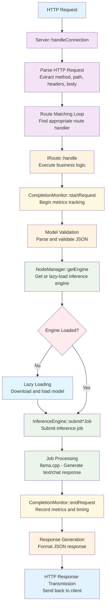
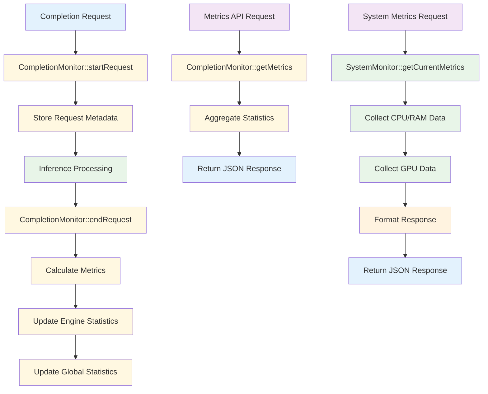
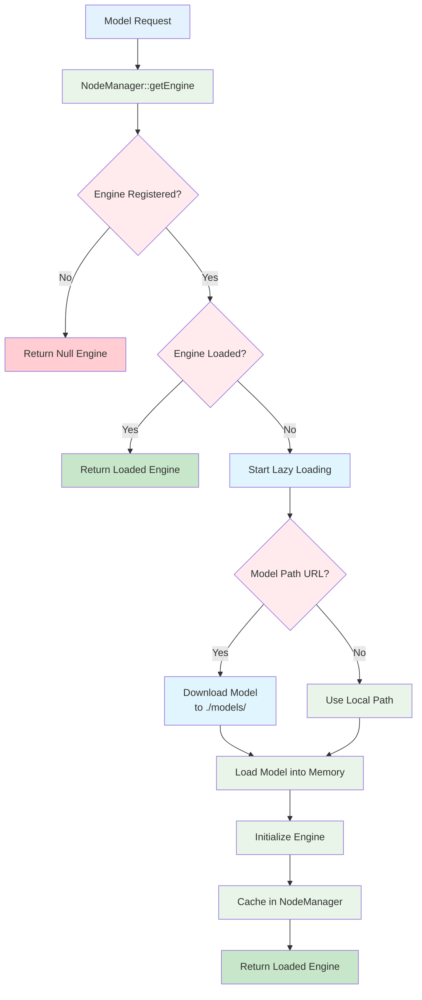
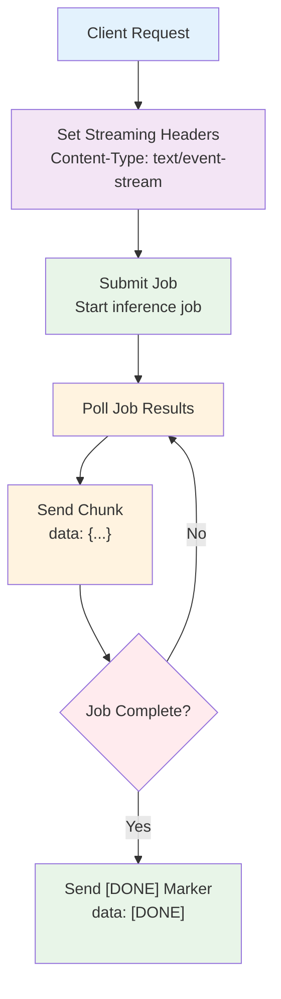

# Architecture Overview

This document provides a detailed overview of the Kolosal Server architecture, including component relationships, data flow, design patterns, and the new monitoring and configuration systems.

## High-Level Architecture



## Component Architecture

### Layer 1: HTTP Server (`Server`)

**Purpose**: Low-level HTTP protocol handling and socket management

**Key Components**:
- Socket listener and connection handler
- HTTP request parsing
- Route matching and dispatch
- Response transmission

**File Locations**:
- `src/server.cpp`
- `include/kolosal/server.hpp`

**Responsibilities**:
```cpp
class Server {
    // Socket management
    bool init();                                    // Initialize server socket
    void run();                                     // Main server loop
    void stop();                                    // Graceful shutdown
    
    // Route management
    void addRoute(std::unique_ptr<IRoute> route);   // Register route handler
    
    // Internal
    void handleConnection(SocketType clientSock);   // Process client connection
    void routeRequest(const HttpRequest& request);  // Route to appropriate handler
};
```

### Layer 2: API Management (`ServerAPI`)

**Purpose**: High-level server management and configuration

**Key Components**:
- Singleton server instance
- Component lifecycle management
- Route registration
- Configuration management

**File Locations**:
- `src/server_api.cpp`
- `include/kolosal/server_api.hpp`

**Responsibilities**:
```cpp
class ServerAPI {
    // Lifecycle
    static ServerAPI& instance();                   // Singleton access
    bool init(const std::string& port);            // Initialize server
    void shutdown();                                // Cleanup and shutdown
    
    // Component access
    NodeManager& getNodeManager();                  // Access model manager
};
```

### Layer 3: Route Handling (`IRoute` implementations)

**Purpose**: Request processing and business logic

**Key Components**:
- Route interface contract
- Request validation and parsing
- Business logic execution
- Response generation

**File Locations**:
- `include/kolosal/routes/route_interface.hpp`
- `src/routes/*.cpp`

**Route Architecture**:
```cpp
class IRoute {
    virtual bool match(const std::string& method, 
                      const std::string& path) = 0;    // Route matching
    virtual void handle(SocketType sock, 
                       const std::string& body) = 0;   // Request processing
};
```

**Available Routes**:
- `ChatCompletionsRoute`: `/v1/chat/completions`
- `CompletionsRoute`: `/v1/completions`
- `AddEngineRoute`: `POST /engines`
- `ListEnginesRoute`: `GET /engines`
- `RemoveEngineRoute`: `DELETE /engines/{id}`
- `EngineStatusRoute`: `GET /engines/{id}/status`
- `HealthStatusRoute`: `GET /v1/health`

### Layer 4: Model Management (`NodeManager`)

**Purpose**: Inference engine lifecycle and resource management

**Key Components**:
- Engine loading and unloading
- Resource optimization
- Multi-model support
- Thread safety

**File Locations**:
- `src/node_manager.cpp`
- `include/kolosal/node_manager.h`

**Architecture**:
```cpp
class NodeManager {
    // Engine management
    bool addEngine(const std::string& engineId,         // Load new engine
                  const char* modelPath,
                  const LoadingParameters& params);
    
    std::shared_ptr<InferenceEngine> getEngine(         // Get engine instance
        const std::string& engineId);
    
    bool removeEngine(const std::string& engineId);     // Unload engine
    
    // Resource management
    std::vector<std::string> listEngineIds();           // List loaded engines
    void cleanupIdleEngines();                          // Memory optimization
    
private:
    std::unordered_map<std::string, EngineInfo> engines;  // Engine registry
    std::mutex enginesMutex;                               // Thread safety
    std::chrono::seconds idleTimeout;                      // Auto-unload timeout
};
```

### Layer 5: Inference Execution (`InferenceEngine`)

**Purpose**: Model inference and generation

**Key Components**:
- Model loading from GGUF files
- Text and chat completion generation
- Asynchronous job processing
- GPU acceleration support

**File Locations**:
- `src/inference.cpp`
- `include/inference.h`
- `include/inference_interface.h`

**Architecture**:
```cpp
class InferenceEngine {
    // Model management
    bool loadModel(const char* modelPath,               // Load GGUF model
                  const LoadingParameters& params);
    void unloadModel();                                 // Free resources
    
    // Job processing
    int submitCompletionsJob(                           // Text completion
        const CompletionParameters& params);
    int submitChatCompletionsJob(                       // Chat completion
        const ChatCompletionParameters& params);
    
    // Result retrieval
    bool isJobFinished(int jobId);                      // Check job status
    CompletionResult getJobResult(int jobId);           // Get results
    std::string getJobError(int jobId);                 // Get error message
    
    // Thread management
    void waitForJob(int jobId);                         // Synchronous wait
    bool hasJobError(int jobId);                        // Error checking
};
```

### Layer 6: Completion Monitoring (`CompletionMonitor`)

**Purpose**: Real-time tracking and metrics for completion requests

**Key Components**:
- Request lifecycle tracking
- Performance metrics calculation (TPS, TTFT, RPS)
- Per-engine statistics
- Thread-safe metrics aggregation

**File Locations**:
- `src/completion_monitor.cpp`
- `include/kolosal/completion_monitor.hpp`

**Architecture**:
```cpp
class CompletionMonitor {
    // Singleton pattern
    static CompletionMonitor& getInstance();
    
    // Request tracking
    void startRequest(const std::string& engine_id,
                     const std::string& model_name,
                     int input_tokens);
    void endRequest(const std::string& engine_id,
                   bool success,
                   int output_tokens,
                   double ttft_ms);
    
    // Metrics retrieval
    CompletionMetrics getMetrics() const;
    CompletionMetrics getEngineMetrics(const std::string& engine_id) const;
    
private:
    std::unordered_map<std::string, EngineMetrics> engine_metrics;
    std::mutex metrics_mutex;
    std::chrono::steady_clock::time_point start_time;
};
```

### Layer 7: System Monitoring (`SystemMonitor`)

**Purpose**: System resource monitoring and health checks

**Key Components**:
- CPU and memory usage tracking
- GPU utilization monitoring (NVML)
- Cross-platform resource detection
- Real-time metrics collection

**File Locations**:
- `src/system_monitor.cpp`
- `src/enhanced_gpu_monitor.cpp`
- Multiple platform-specific implementations

**Architecture**:
```cpp
class SystemMonitor {
    // Resource monitoring
    SystemMetrics getCurrentMetrics();
    bool isGpuMonitoringAvailable();
    
    // Component metrics
    double getCpuUsage();
    MemoryInfo getMemoryInfo();
    std::vector<GpuInfo> getGpuInfo();
    
    // Health status
    HealthStatus getHealthStatus();
};
```

### Layer 8: Configuration Management (`ServerConfig`)

**Purpose**: Configuration loading and validation

**Key Components**:
- JSON/YAML configuration parsing
- Environment variable overrides
- Configuration validation
- Default value management

**File Locations**:
- `src/server_config.cpp`
- `config.example.json`
- `config.example.yaml`

**Architecture**:
```cpp
class ServerConfig {
    // Configuration loading
    bool loadFromFile(const std::string& configPath);
    bool loadFromEnvironment();
    void setDefaults();
    
    // Configuration sections
    ServerSettings getServerSettings() const;
    LoggingSettings getLoggingSettings() const;
    AuthSettings getAuthSettings() const;
    std::vector<ModelConfig> getModelConfigs() const;
    FeatureSettings getFeatureSettings() const;
    
    // Validation
    bool validate() const;
    std::vector<std::string> getValidationErrors() const;
};
```

## Data Flow Architecture

### Request Processing Flow



### Monitoring Data Flow



### Lazy Loading Flow


    style I fill:#e8f5e8
    style J fill:#fff3e0
    style K fill:#e3f2fd
```

### Streaming Response Flow

For streaming endpoints (`stream: true`):



## Threading Model

### Thread Types

1. **Main Thread**
   - HTTP server listener
   - Request routing
   - Route handler execution
   - Configuration loading

2. **Inference Threads**
   - One per loaded model
   - Job queue processing
   - Model inference execution
   - Lazy loading operations

3. **Background Threads**
   - Model loading/unloading
   - Idle engine cleanup
   - Resource monitoring

4. **Monitoring Threads**
   - Completion metrics aggregation
   - System resource monitoring
   - GPU utilization tracking
   - Health status updates

### Thread Safety

**Shared Resources**:
- `NodeManager::engines` (protected by mutex)
- `CompletionMonitor::engine_metrics` (protected by mutex)
- Inference job queues (thread-safe implementation)
- Logging system (thread-safe)
- Configuration data (read-only after loading)

**Thread-Safe Operations**:
```cpp
// NodeManager access
std::lock_guard<std::mutex> lock(enginesMutex);
auto it = engines.find(engineId);

// Completion monitoring (singleton with mutex)
CompletionMonitor& monitor = CompletionMonitor::getInstance();
monitor.startRequest(engine_id, model_name, input_tokens);

// Job submission (internally synchronized)
int jobId = engine->submitChatCompletionsJob(params);

// Metrics access (thread-safe)
std::lock_guard<std::mutex> metrics_lock(metrics_mutex);
auto metrics = engine_metrics[engine_id];

// Logging (thread-safe implementation)
ServerLogger::logInfo("Thread %u processing request", 
                     std::this_thread::get_id());
```

## Memory Management

### Resource Lifecycle

1. **Server Startup**
   ```
   ServerAPI::init() → Server::init() → Socket binding
   ```

2. **Engine Loading**
   ```
   Route request → NodeManager::addEngine() → InferenceEngine::loadModel()
   ```

3. **Request Processing**
   ```
   Job submission → GPU memory allocation → Processing → Result cleanup
   ```

4. **Engine Unloading**
   ```
   Idle timeout/explicit removal → Model unloading → GPU memory release
   ```

### Memory Optimization

**Automatic Cleanup**:
- Idle engine timeout (configurable)
- Job result cleanup after retrieval
- Connection pooling

**Manual Management**:
- Explicit engine removal via API
- Graceful server shutdown
- Resource monitoring endpoints

## Error Handling Strategy

### Error Categories

1. **HTTP Errors** (4xx)
   - 400: Bad Request (malformed JSON, missing fields)
   - 404: Not Found (unknown endpoint, missing engine)
   - 405: Method Not Allowed

2. **Server Errors** (5xx)
   - 500: Internal Server Error (inference failure, system error)
   - 503: Service Unavailable (engine loading, resource exhaustion)

### Error Flow

```cpp
try {
    // Route processing
    parseRequest();
    validateInput();
    executeInference();
    formatResponse();
} catch (const json::exception& ex) {
    // JSON parsing errors → 400
    json error = {{"error", {{"message", "Invalid JSON"}, {"type", "invalid_request_error"}}}};
    send_response(sock, 400, error.dump());
} catch (const std::invalid_argument& ex) {
    // Validation errors → 400
    json error = {{"error", {{"message", ex.what()}, {"type", "invalid_request_error"}}}};
    send_response(sock, 400, error.dump());
} catch (const std::runtime_error& ex) {
    // Runtime errors → 500
    json error = {{"error", {{"message", ex.what()}, {"type", "runtime_error"}}}};
    send_response(sock, 500, error.dump());
} catch (...) {
    // Unknown errors → 500
    json error = {{"error", {{"message", "Internal server error"}, {"type", "internal_server_error"}}}};
    send_response(sock, 500, error.dump());
}
```

## Configuration Architecture

### Compile-Time Configuration

```cmake
# CMakeLists.txt options
option(USE_CUDA "Compile with CUDA support" OFF)
option(USE_VULKAN "Compile with VULKAN support" OFF)
option(DEBUG "Compile with debugging information" OFF)
```

### Runtime Configuration

**Server Configuration**:
- Port number (command line)
- Thread pool size
- Timeout values

**Model Configuration**:
- Context window size (`n_ctx`)
- GPU layer offloading (`n_gpu_layers`)
- Batch size (`n_batch`)
- GPU device selection (`main_gpu_id`)

**Inference Configuration**:
- Temperature, top-p sampling
- Maximum tokens
- Streaming vs non-streaming
- Stop sequences

## Performance Characteristics

### Bottlenecks

1. **Model Loading**: I/O bound, can take 10-60 seconds
2. **First Token**: GPU memory allocation and context processing
3. **Token Generation**: GPU compute bound
4. **Memory Bandwidth**: Large model parameter access

### Optimization Strategies

1. **Model Caching**: Keep frequently used models loaded
2. **Batch Processing**: Process multiple requests together
3. **GPU Utilization**: Optimize layer offloading
4. **Connection Pooling**: Reuse HTTP connections

### Scaling Considerations

**Vertical Scaling**:
- More GPU memory → Larger models
- More CPU cores → Better concurrent request handling
- Faster storage → Quicker model loading

**Horizontal Scaling**:
- Load balancer → Multiple server instances
- Model sharding → Distribute models across nodes
- Caching layer → Redis for session state

## Security Considerations

### Current Limitations

- No authentication mechanism
- No rate limiting
- No input sanitization beyond JSON validation
- No HTTPS support

### Production Recommendations

1. **Authentication**: Implement API key validation
2. **Rate Limiting**: Prevent abuse and DoS
3. **Input Validation**: Sanitize all user inputs
4. **HTTPS/TLS**: Encrypt data in transit
5. **Network Security**: Firewall and VPN access
6. **Monitoring**: Log security events

## Integration Points

### External Dependencies

1. **llama.cpp**: Core inference engine
2. **CURL**: HTTP client functionality
3. **nlohmann/json**: JSON processing
4. **Windows Sockets**: Network communication

### API Compatibility

**OpenAI Compatibility**:
- Request/response format matching
- Error code consistency
- Streaming protocol compliance

**Extension Points**:
- Custom route handlers
- Additional model formats
- Plugin architecture potential

This architecture provides a robust, scalable foundation for LLM inference serving while maintaining compatibility with existing OpenAI-based tooling and workflows.
