# Kolosal Server Developer Guide

This guide provides comprehensive information for developers working on or extending the Kolosal Server project.

## Table of Contents

1. [Getting Started](#getting-started)
2. [Architecture Overview](#architecture-overview)
3. [Adding New Routes](#adding-new-routes)
4. [Adding New Models](#adding-new-models)
5. [API Specification](#api-specification)
6. [Development Workflow](#development-workflow)
7. [Testing](#testing)
8. [Debugging](#debugging)

## Getting Started

### Prerequisites

- **Operating System**: Windows 10/11 
- **Development Environment**: Visual Studio 2019 or later
- **Build System**: CMake 3.20+
- **Optional**: CUDA Toolkit (for GPU acceleration)
- **Languages**: C++17 or later

### Setting Up Development Environment

1. **Clone the Repository**
   ```bash
   git clone https://github.com/your-org/kolosal-server.git
   cd kolosal-server
   ```

2. **Initialize Submodules**
   ```bash
   git submodule update --init --recursive
   ```

3. **Build the Project**
   ```bash
   mkdir build && cd build
   cmake ..
   cmake --build . --config Debug
   ```

4. **Run the Server**
   ```bash
   ./Debug/kolosal-server.exe
   ```

### Project Structure

```mermaid
graph TD
    A[kolosal-server/] --> B[build/]
    A --> C[docs/]
    A --> D[external/]
    A --> E[include/]
    A --> F[src/]
    A --> G[CMakeLists.txt]
    A --> H[README.md]
    
    B --> B1[Build artifacts - generated]
    C --> C1[Documentation]
    D --> D1[curl/ - HTTP client library]
    D --> D2[llama.cpp/ - LLM inference engine]
    D --> D3[nlohmann/ - JSON library]
    
    E --> E1[kolosal/]
    E --> E2[inference.h]
    E --> E3[kolosal_server.hpp]
    E1 --> E11[models/ - Data models]
    E1 --> E12[routes/ - Route handlers]
    
    F --> F1[routes/ - Route implementations]
    F --> F2[main.cpp - Application entry point]
    F --> F3[server.cpp - HTTP server implementation]
    F --> F4[server_api.cpp - Server API wrapper]
    F --> F5[node_manager.cpp - Model management]
    F --> F6[inference.cpp - Inference engine implementation]
    
    style A fill:#e1f5fe
    style B fill:#fff3e0
    style C fill:#f3e5f5
    style D fill:#e8f5e8
    style E fill:#fff8e1
    style F fill:#fce4ec
    style G fill:#e0f2f1
    style H fill:#e0f2f1
```



## Architecture Overview

The Kolosal Server follows a modular architecture with clear separation of concerns:

### Core Components

#### 1. Server Layer (`Server`)
- **Location**: `src/server.cpp`, `include/kolosal/server.hpp`
- **Purpose**: HTTP server implementation handling socket connections
- **Responsibilities**:
  - Socket management and HTTP protocol handling
  - Request routing to appropriate handlers
  - Response formatting and transmission

#### 2. API Layer (`ServerAPI`)
- **Location**: `src/server_api.cpp`, `include/kolosal/server_api.hpp`
- **Purpose**: High-level API wrapper and singleton server instance
- **Responsibilities**:
  - Server lifecycle management
  - Route registration
  - Thread management

#### 3. Route Layer (`IRoute` implementations)
- **Location**: `src/routes/`, `include/kolosal/routes/`
- **Purpose**: Request handling logic for specific endpoints
- **Responsibilities**:
  - Request validation and parsing
  - Business logic execution
  - Response generation

#### 4. Model Management (`NodeManager`)
- **Location**: `src/node_manager.cpp`, `include/kolosal/node_manager.h`
- **Purpose**: Manages multiple inference engines
- **Responsibilities**:
  - Loading and unloading models
  - Engine lifecycle management
  - Resource optimization

#### 5. Inference Layer (`InferenceEngine`)
- **Location**: `src/inference.cpp`, `include/inference.h`
- **Purpose**: LLM inference execution
- **Responsibilities**:
  - Model loading and initialization
  - Text and chat completion generation
  - Job queue management

### Data Flow

```
HTTP Request → Server → Route → NodeManager → InferenceEngine → Response
```

1. **HTTP Request**: Client sends request to server
2. **Server**: Parses HTTP and routes to appropriate handler
3. **Route**: Validates request and extracts parameters
4. **NodeManager**: Provides access to appropriate inference engine
5. **InferenceEngine**: Executes model inference
6. **Response**: Results flow back through the same path

### Threading Model

- **Main Thread**: HTTP server and request routing
- **Worker Threads**: Inference processing (one per engine)
- **Background Threads**: Model loading/unloading, cleanup

## Adding New Routes

Routes handle specific API endpoints. Follow this pattern to add new functionality:

### 1. Create Route Header

Create `include/kolosal/routes/your_route.hpp`:

```cpp
#pragma once

#include "route_interface.hpp"
#include "../export.hpp"

namespace kolosal {
    class KOLOSAL_SERVER_API YourRoute : public IRoute {
    public:
        bool match(const std::string& method, const std::string& path) override;
        void handle(SocketType sock, const std::string& body) override;
    };
}
```

### 2. Implement Route Logic

Create `src/routes/your_route.cpp`:

```cpp
#include "kolosal/routes/your_route.hpp"
#include "kolosal/utils.hpp"
#include "kolosal/server_api.hpp"
#include "kolosal/logger.hpp"
#include <json.hpp>

using json = nlohmann::json;

namespace kolosal {
    
    bool YourRoute::match(const std::string& method, const std::string& path) {
        // Define which HTTP method and path this route handles
        return (method == "POST" && path == "/v1/your-endpoint");
    }
    
    void YourRoute::handle(SocketType sock, const std::string& body) {
        try {
            ServerLogger::logInfo("[Thread %u] Received your-endpoint request", 
                                 std::this_thread::get_id());
            
            // Parse request body
            auto j = json::parse(body);
            
            // Validate required fields
            if (!j.contains("required_field")) {
                throw std::invalid_argument("Missing required_field");
            }
            
            // Process request
            // ... your business logic here ...
            
            // Create response
            json response = {
                {"status", "success"},
                {"data", "your_result"}
            };
            
            // Send response
            send_response(sock, 200, response.dump());
              } catch (const json::exception& ex) {
            ServerLogger::logError("JSON parsing error: %s", ex.what());
            json error = {
                {"error", {
                    {"message", "Invalid JSON in request body"},
                    {"type", "invalid_request_error"}
                }}
            };
            send_response(sock, 400, error.dump());
        } catch (const std::exception& ex) {
            ServerLogger::logError("Error processing request: %s", ex.what());
            json error = {
                {"error", {
                    {"message", ex.what()},
                    {"type", "internal_server_error"}
                }}
            };
            send_response(sock, 500, error.dump());
        }
    }
}
```

### 3. Register Route

Add your route to `src/server_api.cpp`:

```cpp
#include "kolosal/routes/your_route.hpp"

// In ServerAPI::init()
pImpl->server->addRoute(std::make_unique<YourRoute>());
```

### 4. Update Build System

Add to `CMakeLists.txt`:

```cmake
set(SOURCES
    # ... existing sources ...
    src/routes/your_route.cpp
)
```

### Route Best Practices

1. **Error Handling**: Always wrap main logic in try-catch
2. **Logging**: Use ServerLogger for consistent logging
3. **Validation**: Validate all input parameters
4. **HTTP Status**: Return appropriate HTTP status codes
5. **Thread Safety**: Routes may be called concurrently
6. **Resource Cleanup**: Ensure proper resource management

### Example: Streaming Route

For streaming responses (like chat completions):

```cpp
void YourStreamingRoute::handle(SocketType sock, const std::string& body) {
    try {
        // Set up streaming headers
        std::string headers = 
            "HTTP/1.1 200 OK\r\n"
            "Content-Type: text/event-stream\r\n"
            "Cache-Control: no-cache\r\n"
            "Connection: keep-alive\r\n"
            "\r\n";
        
        send(sock, headers.c_str(), headers.length(), 0);
        
        // Stream data chunks
        while (has_more_data) {
            std::string chunk = "data: " + get_next_chunk() + "\n\n";
            send(sock, chunk.c_str(), chunk.length(), 0);
        }
        
        // Send completion marker
        std::string done = "data: [DONE]\n\n";
        send(sock, done.c_str(), done.length(), 0);
        
    } catch (...) {
        // Handle errors appropriately
    }
}
```

## Adding New Models

The Kolosal Server uses data models to represent API requests and responses. Here's how to add new models:

### 1. Create Model Header

Create `include/kolosal/models/your_model.hpp`:

```cpp
#pragma once

#include "../export.hpp"
#include "model_interface.hpp"
#include <string>
#include <json.hpp>

namespace kolosal {
    class KOLOSAL_SERVER_API YourModel : public IModel {
    public:
        // Model properties
        std::string field1;
        int field2;
        bool field3;
        
        // Constructor
        YourModel() = default;
        
        // Validation
        bool validate() const override;
        
        // JSON serialization
        void from_json(const nlohmann::json& j) override;
        nlohmann::json to_json() const override;
    };
}
```

### 2. Implement Model

Create `src/models/your_model.cpp`:

```cpp
#include "kolosal/models/your_model.hpp"
#include <stdexcept>

namespace kolosal {
    
    bool YourModel::validate() const {
        // Implement validation logic
        if (field1.empty()) {
            return false;
        }
        if (field2 < 0) {
            return false;
        }
        return true;
    }
    
    void YourModel::from_json(const nlohmann::json& j) {
        // Parse JSON to model fields
        if (j.contains("field1")) {
            field1 = j["field1"].get<std::string>();
        }
        if (j.contains("field2")) {
            field2 = j["field2"].get<int>();
        }
        if (j.contains("field3")) {
            field3 = j["field3"].get<bool>();
        }
    }
    
    nlohmann::json YourModel::to_json() const {
        return nlohmann::json{
            {"field1", field1},
            {"field2", field2},
            {"field3", field3}
        };
    }
}
```

### Model Guidelines

1. **Inheritance**: All models should inherit from `IModel`
2. **Validation**: Implement thorough validation in `validate()`
3. **Optional Fields**: Handle optional JSON fields gracefully
4. **Error Handling**: Use exceptions for parsing errors
5. **Consistency**: Follow naming conventions (snake_case for JSON, camelCase for C++)

## API Specification

### Request/Response Format

All API endpoints follow OpenAI-compatible format where applicable:

#### Standard Request Format
```json
{
    "model": "string",
    "stream": boolean,
    "temperature": number,
    "max_tokens": number,
    // ... endpoint-specific fields
}
```

#### Standard Response Format
```json
{
    "id": "string",
    "object": "string",
    "created": number,
    "model": "string",
    "choices": [...],
    "usage": {
        "prompt_tokens": number,
        "completion_tokens": number,
        "total_tokens": number
    }
}
```

#### Error Response Format
```json
{
    "error": {
        "message": "string",
        "type": "string",
        "param": "string",
        "code": "string"
    }
}
```

### Supported Endpoints

| Endpoint | Method | Purpose |
|----------|--------|---------|
| `/v1/chat/completions` | POST | OpenAI-compatible chat completions |
| `/v1/completions` | POST | OpenAI-compatible text completions |
| `/engines` | GET/POST/DELETE | Engine management |
| `/engines/{id}/status` | GET | Engine status |
| `/v1/health` | GET | Health check |

### Authentication

Currently, the server doesn't implement authentication. For production use, consider adding:

1. **API Key Authentication**: Bearer token validation
2. **Rate Limiting**: Request throttling per client
3. **CORS**: Cross-origin request handling

### Content Types

- **Request**: `application/json`
- **Response**: `application/json` (normal) or `text/event-stream` (streaming)

## Development Workflow

### Code Style

Follow these coding standards:

1. **C++ Standard**: C++17 or later
2. **Naming**:
   - Classes: `PascalCase`
   - Functions/Variables: `camelCase`
   - Constants: `UPPER_SNAKE_CASE`
   - Files: `snake_case`
3. **Headers**: Use `#pragma once`
4. **Namespaces**: All code in `kolosal` namespace
5. **Includes**: Order: system, external, internal

### Git Workflow

1. **Branching**: Use feature branches (`feature/new-feature`)
2. **Commits**: Use conventional commit messages
3. **Pull Requests**: Require code review
4. **Testing**: Ensure all tests pass before merging

### Building Variants

```bash
# Debug build (default)
cmake --build . --config Debug

# Release build (optimized)
cmake --build . --config Release

# With CUDA support
cmake -DUSE_CUDA=ON ..
cmake --build . --config Release
```

### Common Development Tasks

#### Adding Dependencies

1. **External Library**: Add to `external/` directory
2. **CMake Integration**: Update `CMakeLists.txt`
3. **Include Paths**: Update include directories

#### Updating API

1. **Model Changes**: Update request/response models
2. **Route Changes**: Implement new route logic
3. **Documentation**: Update API documentation
4. **Testing**: Add integration tests

#### Performance Optimization

1. **Profiling**: Use Visual Studio profiler
2. **Memory**: Check for leaks with Application Verifier
3. **Threading**: Optimize thread pool usage
4. **GPU**: Tune CUDA layer offloading

## Testing

### Unit Tests

Create tests in `tests/` directory:

```cpp
#include <gtest/gtest.h>
#include "kolosal/models/your_model.hpp"

class YourModelTest : public ::testing::Test {
protected:
    void SetUp() override {
        // Test setup
    }
};

TEST_F(YourModelTest, ValidateValidModel) {
    YourModel model;
    model.field1 = "valid";
    model.field2 = 42;
    EXPECT_TRUE(model.validate());
}

TEST_F(YourModelTest, ValidateInvalidModel) {
    YourModel model;
    model.field1 = "";  // Invalid
    EXPECT_FALSE(model.validate());
}
```

### Integration Tests

Test full API endpoints:

```python
import requests
import json

def test_health_endpoint():
    response = requests.get('http://localhost:8080/v1/health')
    assert response.status_code == 200
    assert response.json()['status'] == 'healthy'

def test_chat_completion():
    data = {
        "model": "test-model",
        "messages": [{"role": "user", "content": "Hello"}],
        "max_tokens": 50
    }
    response = requests.post('http://localhost:8080/v1/chat/completions', 
                           json=data)
    assert response.status_code == 200
    assert 'choices' in response.json()
```

### Manual Testing

Use the provided PowerShell scripts or curl commands:

```powershell
# Test health endpoint
Invoke-RestMethod -Uri "http://localhost:8080/v1/health" -Method GET

# Test chat completion
$body = @{
    model = "test-model"
    messages = @(@{role = "user"; content = "Hello"})
    max_tokens = 50
} | ConvertTo-Json -Depth 3

Invoke-RestMethod -Uri "http://localhost:8080/v1/chat/completions" `
                  -Method POST -Body $body -ContentType "application/json"
```

## Debugging

### Logging

Use the built-in logging system:

```cpp
#include "kolosal/logger.hpp"

// Log levels
ServerLogger::logError("Error message: %s", error.c_str());
ServerLogger::logWarning("Warning message");
ServerLogger::logInfo("Info message");
ServerLogger::logDebug("Debug message");
```

### Visual Studio Debugging

1. **Set Breakpoints**: In route handlers and inference code
2. **Watch Variables**: Monitor request/response objects
3. **Call Stack**: Trace execution flow
4. **Memory Usage**: Check for memory leaks

### Common Issues

#### Model Loading Failures
- **Check**: Model file path and permissions
- **Verify**: GGUF format compatibility
- **Monitor**: GPU memory usage

#### Request Parsing Errors
- **Validate**: JSON format and required fields
- **Check**: Content-Type headers
- **Debug**: Log raw request body

#### Performance Issues
- **Profile**: Identify bottlenecks
- **Optimize**: Model parameters (context size, batch size)
- **Scale**: Use multiple engines for load balancing

### Production Debugging

1. **Log Analysis**: Use structured logging
2. **Metrics**: Monitor response times and error rates
3. **Health Checks**: Implement comprehensive health monitoring
4. **Distributed Tracing**: For multi-service deployments

## Contributing

1. **Issues**: Report bugs and feature requests on GitHub
2. **Code Review**: All changes require peer review
3. **Documentation**: Update docs for API changes
4. **Testing**: Add tests for new functionality
5. **Performance**: Consider performance impact of changes

## Resources

- [llama.cpp Documentation](https://github.com/ggerganov/llama.cpp)
- [OpenAI API Reference](https://platform.openai.com/docs/api-reference)
- [CMake Documentation](https://cmake.org/documentation/)
- [nlohmann/json Documentation](https://github.com/nlohmann/json)
