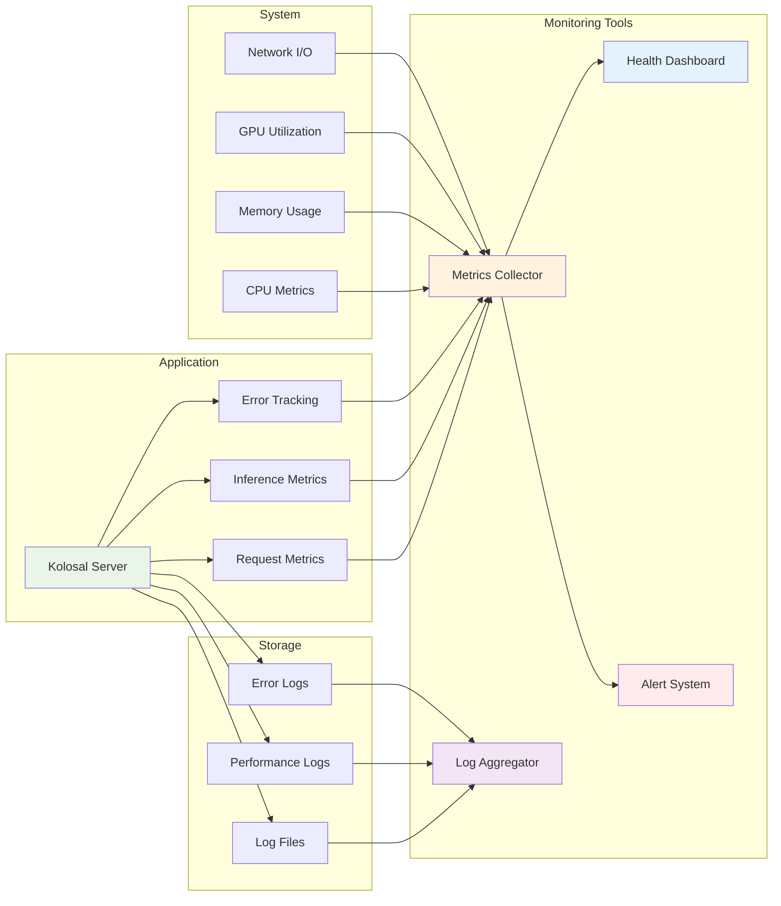

# Production Deployment Guide

This guide covers deploying and operating Kolosal Server in production environments.

## 📋 Table of Contents

1. [Prerequisites](#prerequisites)
2. [Production Build](#production-build)
3. [Configuration](#configuration)
4. [Deployment Options](#deployment-options)
5. [Security](#security)
6. [Monitoring](#monitoring)
7. [Performance Tuning](#performance-tuning)
8. [Scaling](#scaling)
9. [Troubleshooting](#troubleshooting)

## Prerequisites

### System Requirements

**Minimum Requirements:**
- **OS**: Windows Server 2019 or later
- **CPU**: 8 cores, 2.4 GHz
- **RAM**: 16 GB
- **Storage**: 100 GB available space
- **GPU** (optional): NVIDIA GPU with 8GB+ VRAM

**Recommended Requirements:**
- **OS**: Windows Server 2022
- **CPU**: 16 cores, 3.0 GHz
- **RAM**: 32 GB or more
- **Storage**: 500 GB SSD
- **GPU**: NVIDIA RTX 4090 or similar (24GB+ VRAM)

### Software Dependencies

```powershell
# Install Visual C++ Redistributable
# Download from Microsoft official site

# Install CUDA Toolkit (for GPU acceleration)
# Download CUDA 12.x from NVIDIA

# Verify installations
nvidia-smi  # Should show GPU information
```

## Production Build

### Build Configuration

Create a production build with optimizations:

```powershell
# Clone repository
git clone https://github.com/your-org/kolosal-server.git
cd kolosal-server

# Initialize submodules
git submodule update --init --recursive

# Create build directory
mkdir build-production
cd build-production

# Configure for production with GPU support
cmake .. -DCMAKE_BUILD_TYPE=Release -DUSE_CUDA=ON -DUSE_VULKAN=OFF

# Build with maximum optimization
cmake --build . --config Release --parallel
```

### Build Verification

```powershell
# Test the build
.\Release\kolosal-server.exe --version

# Quick functionality test
.\Release\kolosal-server.exe &
Start-Sleep 5

# Test health endpoint
Invoke-RestMethod -Uri "http://localhost:8080/v1/health" -Method GET

# Stop test server
Stop-Process -Name "kolosal-server"
```

## Configuration

### Environment Configuration

Create a production configuration file:

**File**: `config\production.json`

```json
{
  "server": {
    "port": 8080,
    "host": "0.0.0.0",
    "max_connections": 1000,
    "request_timeout_seconds": 300,
    "keep_alive_timeout_seconds": 60
  },
  "logging": {
    "level": "INFO",
    "file_path": "logs/kolosal-server.log",
    "max_file_size_mb": 100,
    "max_files": 10,
    "console_output": false
  },
  "security": {
    "cors_enabled": true,
    "cors_origins": ["https://yourdomain.com"],
    "rate_limiting": {
      "enabled": true,
      "requests_per_minute": 100,
      "burst_size": 20
    }
  },
  "inference": {
    "default_context_size": 4096,
    "default_gpu_layers": 100,
    "model_cache_size_gb": 8,
    "job_timeout_seconds": 600
  }
}
```

### Model Configuration

**File**: `config\models.json`

```json
{
  "models": [
    {
      "engine_id": "llama-7b-chat",
      "model_path": "models/llama-7b-chat-q4.gguf",
      "auto_load": true,
      "n_ctx": 4096,
      "n_gpu_layers": 32,
      "priority": "high"
    },
    {
      "engine_id": "codellama-13b",
      "model_path": "models/codellama-13b-q4.gguf",
      "auto_load": false,
      "n_ctx": 2048,
      "n_gpu_layers": 40,
      "priority": "medium"
    }
  ]
}
```

## Deployment Architecture

The following diagram shows the recommended production deployment architecture:


## Deployment Options

### Option 1: Windows Service

Create a Windows service for automatic startup:

**File**: `scripts\install-service.ps1`

```powershell
# Install as Windows Service
$serviceName = "KolosalServer"
$serviceDisplayName = "Kolosal AI Inference Server"
$serviceDescription = "High-performance LLM inference server"
$executablePath = "C:\kolosal-server\Release\kolosal-server.exe"

# Create the service
New-Service -Name $serviceName `
           -DisplayName $serviceDisplayName `
           -Description $serviceDescription `
           -BinaryPathName $executablePath `
           -StartupType Automatic

# Start the service
Start-Service -Name $serviceName

# Verify service status
Get-Service -Name $serviceName
```

### Option 2: IIS Reverse Proxy

Configure IIS as a reverse proxy:

**File**: `config\web.config`

```xml
<?xml version="1.0" encoding="utf-8"?>
<configuration>
  <system.webServer>
    <rewrite>
      <rules>
        <rule name="ReverseProxyToKolosal" stopProcessing="true">
          <match url="^api/(.*)" />
          <action type="Rewrite" url="http://localhost:8080/{R:1}" />
        </rule>
      </rules>
    </rewrite>
  </system.webServer>
</configuration>
```

### Option 3: Docker Container

**File**: `Dockerfile`

```dockerfile
FROM mcr.microsoft.com/windows/servercore:ltsc2022

# Install Visual C++ Redistributable
ADD https://aka.ms/vs/17/release/vc_redist.x64.exe /temp/vc_redist.x64.exe
RUN /temp/vc_redist.x64.exe /quiet /install

# Copy application
COPY Release/ /app/
COPY models/ /app/models/
COPY config/ /app/config/

WORKDIR /app

EXPOSE 8080

CMD ["kolosal-server.exe", "--config", "config/production.json"]
```

## Security

### Authentication Implementation

**File**: `include\kolosal\auth\api_key_auth.hpp`

```cpp
#pragma once

#include <string>
#include <unordered_set>

class ApiKeyAuth {
public:
    bool validateApiKey(const std::string& apiKey) const;
    void loadApiKeys(const std::string& configPath);
    
private:
    std::unordered_set<std::string> validApiKeys;
};
```

### Rate Limiting

```cpp
class RateLimiter {
public:
    bool allowRequest(const std::string& clientId);
    void setLimits(int requestsPerMinute, int burstSize);
    
private:
    std::unordered_map<std::string, ClientQuota> clientQuotas;
};
```

### SSL/TLS Configuration

For HTTPS support, use a reverse proxy like NGINX or IIS:

**NGINX Configuration**:
```nginx
server {
    listen 443 ssl;
    server_name yourdomain.com;
    
    ssl_certificate /path/to/certificate.crt;
    ssl_certificate_key /path/to/private.key;
    
    location / {
        proxy_pass http://localhost:8080;
        proxy_set_header Host $host;
        proxy_set_header X-Real-IP $remote_addr;
        proxy_set_header X-Forwarded-For $proxy_add_x_forwarded_for;
        proxy_set_header X-Forwarded-Proto $scheme;
    }
}
```

## Monitoring

### Monitoring Flow

The monitoring system collects metrics from multiple sources:



### Application Metrics

**File**: `include\kolosal\metrics\metrics_collector.hpp`

```cpp
class MetricsCollector {
public:
    void recordRequest(const std::string& endpoint, int statusCode, double duration);
    void recordInference(const std::string& model, int tokens, double tps);
    void recordError(const std::string& errorType);
    
    json getMetrics() const;
    
private:
    std::atomic<uint64_t> totalRequests{0};
    std::atomic<uint64_t> totalErrors{0};
    std::atomic<double> avgResponseTime{0.0};
};
```

### Health Check Endpoint

Enhanced health check with detailed metrics:

```cpp
json getDetailedHealth() {
    return json{
        {"status", "healthy"},
        {"timestamp", std::time(nullptr)},
        {"uptime_seconds", getUptimeSeconds()},
        {"memory_usage_mb", getMemoryUsageMB()},
        {"gpu_memory_usage_mb", getGpuMemoryUsageMB()},
        {"active_connections", getActiveConnections()},
        {"models", {
            {"loaded", getLoadedModelCount()},
            {"total", getTotalModelCount()}
        }},
        {"performance", {
            {"requests_per_second", getRequestsPerSecond()},
            {"avg_inference_time_ms", getAvgInferenceTime()},
            {"cache_hit_rate", getCacheHitRate()}
        }}
    };
}
```

### Logging Configuration

**File**: `config\logging.json`

```json
{
  "loggers": {
    "root": {
      "level": "INFO",
      "handlers": ["file", "console"]
    },
    "kolosal.inference": {
      "level": "DEBUG",
      "handlers": ["inference_file"]
    },
    "kolosal.security": {
      "level": "WARN",
      "handlers": ["security_file"]
    }
  },
  "handlers": {
    "file": {
      "type": "rotating_file",
      "filename": "logs/kolosal.log",
      "max_size": "100MB",
      "backup_count": 10
    },
    "console": {
      "type": "console",
      "level": "ERROR"
    },
    "inference_file": {
      "type": "rotating_file",
      "filename": "logs/inference.log",
      "max_size": "50MB",
      "backup_count": 5
    }
  }
}
```

### External Monitoring Integration

**Prometheus Metrics Endpoint**:

```cpp
// GET /metrics endpoint for Prometheus
std::string generatePrometheusMetrics() {
    std::ostringstream metrics;
    
    metrics << "# HELP kolosal_requests_total Total number of requests\n";
    metrics << "# TYPE kolosal_requests_total counter\n";
    metrics << "kolosal_requests_total " << getTotalRequests() << "\n";
    
    metrics << "# HELP kolosal_inference_duration_seconds Inference duration\n";
    metrics << "# TYPE kolosal_inference_duration_seconds histogram\n";
    metrics << "kolosal_inference_duration_seconds_bucket{le=\"0.1\"} " << getBucketCount(0.1) << "\n";
    
    return metrics.str();
}
```

## Performance Tuning

### GPU Optimization

```cpp
// Optimize GPU layer distribution
struct GpuConfig {
    int totalLayers = 32;
    int gpuLayers = 28;          // Leave some layers on CPU
    int mainGpu = 0;             // Primary GPU
    std::vector<float> tensorSplit = {0.7, 0.3};  // Multi-GPU split
};
```

### Memory Management

```cpp
class MemoryManager {
public:
    void configureCache(size_t maxCacheSizeGB) {
        maxCacheSize = maxCacheSizeGB * 1024 * 1024 * 1024;
    }
    
    void enableMemoryMapping(bool enable) {
        useMemoryMapping = enable;
    }
    
    void setSwapThreshold(float threshold) {
        swapThreshold = threshold;  // Swap when memory usage > threshold
    }
};
```

### Connection Pooling

```cpp
class ConnectionPool {
public:
    void setMaxConnections(int maxConn) { maxConnections = maxConn; }
    void setKeepAliveTimeout(int seconds) { keepAliveTimeout = seconds; }
    void enableCompression(bool enable) { compressionEnabled = enable; }
};
```

## Scaling

### Horizontal Scaling

**Load Balancer Configuration** (HAProxy):

```
backend kolosal_servers
    balance roundrobin
    option httpchk GET /v1/health
    
    server kolosal1 10.0.1.10:8080 check
    server kolosal2 10.0.1.11:8080 check
    server kolosal3 10.0.1.12:8080 check
```

### Vertical Scaling

**Resource Allocation**:

```powershell
# Set process priority
$process = Get-Process -Name "kolosal-server"
$process.PriorityClass = "High"

# Set CPU affinity (use specific cores)
$process.ProcessorAffinity = 0xFF  # Use first 8 cores

# Increase memory limits
# Configure in application settings
```

### Model Sharding

Distribute models across multiple instances:

```json
{
  "model_distribution": {
    "server_1": ["llama-7b-chat", "codellama-7b"],
    "server_2": ["llama-13b-chat", "mistral-7b"],
    "server_3": ["gpt-3.5-turbo", "claude-instant"]
  },
  "routing_strategy": "round_robin"
}
```

## Troubleshooting

### Common Issues

#### High Memory Usage

```powershell
# Monitor memory usage
Get-Process -Name "kolosal-server" | Select-Object Name, CPU, WorkingSet

# Check for memory leaks
# Use Application Verifier or similar tools
```

**Solutions**:
- Reduce model cache size
- Enable model swapping
- Increase system RAM
- Use smaller quantized models

#### GPU Out of Memory

```bash
# Check GPU memory usage
nvidia-smi

# Monitor VRAM usage over time
nvidia-smi -l 1
```

**Solutions**:
- Reduce GPU layers (`n_gpu_layers`)
- Use smaller batch sizes
- Enable gradient checkpointing
- Use model quantization

#### Connection Timeouts

**Symptoms**:
- Client connection timeouts
- High response times
- Connection pool exhaustion

**Solutions**:
```cpp
// Increase timeouts
server.setReadTimeout(300);   // 5 minutes
server.setWriteTimeout(300);
server.setKeepAliveTimeout(60);

// Increase connection pool
server.setMaxConnections(2000);
```

#### Model Loading Failures

**Common Causes**:
- Insufficient disk space
- Corrupted model files
- Incompatible model format
- Permission issues

**Debugging**:
```powershell
# Check disk space
Get-WmiObject -Class Win32_LogicalDisk

# Verify model file integrity
Get-FileHash -Path "models\model.gguf" -Algorithm SHA256

# Check file permissions
Get-Acl -Path "models\model.gguf"
```

### Performance Debugging

#### Profiling

```cpp
// Add performance profiling
class Profiler {
public:
    void startTimer(const std::string& name) {
        timers[name] = std::chrono::high_resolution_clock::now();
    }
    
    void endTimer(const std::string& name) {
        auto end = std::chrono::high_resolution_clock::now();
        auto duration = std::chrono::duration_cast<std::chrono::milliseconds>(
            end - timers[name]).count();
        
        ServerLogger::logInfo("Timer %s: %lld ms", name.c_str(), duration);
    }
};
```

#### Memory Analysis

```powershell
# Use Windows Performance Analysis Tools
# Install Windows Performance Toolkit

# Capture memory trace
wpa.exe

# Analyze heap usage
# Use Application Verifier for detailed analysis
```

### Log Analysis

**PowerShell Log Analysis**:

```powershell
# Search for errors in logs
Select-String -Path "logs\kolosal.log" -Pattern "ERROR" | Select-Object -Last 10

# Monitor live logs
Get-Content "logs\kolosal.log" -Wait -Tail 50

# Extract performance metrics
Select-String -Path "logs\kolosal.log" -Pattern "inference.*completed.*(\d+\.?\d*).*tps" | 
    ForEach-Object { [regex]::Match($_.Line, "(\d+\.?\d+).*tps").Groups[1].Value }
```

### Emergency Procedures

#### Service Recovery

```powershell
# Automatic service restart script
function Restart-KolosalService {
    $serviceName = "KolosalServer"
    
    try {
        Stop-Service -Name $serviceName -Force -ErrorAction Stop
        Start-Sleep 10
        Start-Service -Name $serviceName -ErrorAction Stop
        
        Write-Host "Service restarted successfully"
    }
    catch {
        Write-Error "Failed to restart service: $_"
        # Send alert notification
        Send-AlertNotification "Kolosal Server restart failed"
    }
}

# Schedule periodic health checks
$action = New-ScheduledTaskAction -Execute "PowerShell.exe" -Argument "-File C:\scripts\health-check.ps1"
$trigger = New-ScheduledTaskTrigger -RepetitionInterval (New-TimeSpan -Minutes 5) -Once -At (Get-Date)
Register-ScheduledTask -TaskName "KolosalHealthCheck" -Action $action -Trigger $trigger
```

#### Backup and Recovery

```powershell
# Backup configuration and models
function Backup-KolosalData {
    $backupPath = "C:\backup\kolosal-$(Get-Date -Format 'yyyyMMdd-HHmmss')"
    New-Item -Path $backupPath -ItemType Directory
    
    # Backup configuration
    Copy-Item "config\*" -Destination "$backupPath\config" -Recurse
    
    # Backup logs (recent only)
    Copy-Item "logs\*.log" -Destination "$backupPath\logs"
    
    # Backup model configurations (not the models themselves due to size)
    Copy-Item "config\models.json" -Destination "$backupPath\"
    
    Write-Host "Backup completed: $backupPath"
}
```

This production deployment guide provides comprehensive coverage of deploying, securing, monitoring, and troubleshooting Kolosal Server in production environments. Follow these guidelines to ensure reliable, secure, and performant operation of your inference server.
