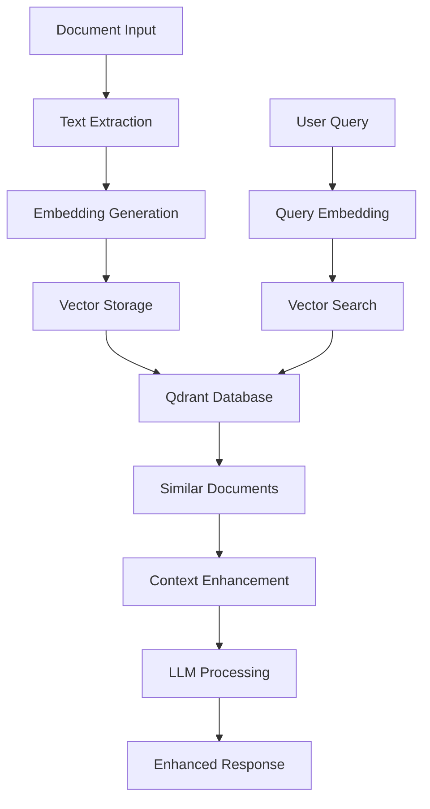

# Retrieval-Augmented Generation (RAG) System

## Overview

The Kolosal Server includes a comprehensive RAG (Retrieval-Augmented Generation) system that enables agents to search, retrieve, and utilize relevant documents from a knowledge base to enhance their responses. This system combines vector search capabilities with large language models to provide contextually relevant and accurate information.

## Architecture

### Core Components

1. **DocumentService**: Manages document indexing, embedding generation, and vector storage
2. **QdrantClient**: Interfaces with Qdrant vector database for similarity search
3. **EmbeddingEngine**: Generates vector embeddings from text using inference models
4. **RetrievalFunctions**: Agent functions for document search and retrieval
5. **DocumentParsers**: Extract text from various document formats (PDF, DOCX, etc.)

### Data Flow



## Features

### Document Management

- **Multi-format Support**: PDF, DOCX, and plain text documents
- **Automatic Indexing**: Seamless document processing and vector storage
- **Metadata Handling**: Rich metadata support for filtering and organization
- **Batch Processing**: Efficient handling of multiple documents

### Vector Search

- **Semantic Similarity**: Advanced vector similarity search using cosine similarity
- **Configurable Thresholds**: Adjustable similarity score thresholds
- **Scalable Search**: Efficient search across large document collections
- **Ranked Results**: Documents ranked by relevance score

### Context Enhancement

- **Automatic Formatting**: Context formatted for optimal LLM consumption
- **Flexible Formats**: Summary or detailed context formats
- **Dynamic Context**: Context adapted based on query and use case
- **Token Optimization**: Efficient token usage for context inclusion

## Configuration

### Database Configuration

```yaml
# Database configuration for RAG system
database:
  qdrant:
    enabled: true
    host: "localhost"
    port: 6333
    apiKey: ""
    timeout: 30
    maxConnections: 10
    connectionTimeout: 5
    defaultEmbeddingModel: "default"
```

### Agent Configuration

```yaml
agents:
  - name: "rag_assistant"
    type: "research"
    role: "RAG-enhanced research assistant"
    system_prompt: >
      You are a research assistant with access to a knowledge base.
      Use the retrieved context to provide accurate and comprehensive answers.
    capabilities:
      - "retrieval"
      - "context_retrieval"
      - "text_processing"
      - "data_analysis"
    functions:
      - "inference"
      - "retrieval"
      - "context_retrieval"
      - "add_document"
      - "remove_document"
    auto_start: true
    max_concurrent_jobs: 3
```

## API Endpoints

### Document Retrieval

#### Basic Retrieval
```http
POST /retrieve
```

**Request Body:**
```json
{
  "query": "machine learning algorithms",
  "k": 5,
  "score_threshold": 0.6,
  "collection_name": "documents"
}
```

**Response:**
```json
{
  "documents": [
    {
      "id": "doc_123",
      "text": "Machine learning is a subset of artificial intelligence...",
      "score": 0.85,
      "metadata": {
        "source": "ML_Guide.pdf",
        "page": 1,
        "category": "introduction"
      }
    }
  ],
  "query": "machine learning algorithms",
  "k": 5,
  "collection_name": "documents",
  "total_found": 1,
  "score_threshold": 0.6
}
```

### Document Management

#### Add Documents
```http
POST /api/v1/documents
```

**Request Body:**
```json
{
  "documents": [
    {
      "text": "Machine learning is a subset of artificial intelligence...",
      "metadata": {
        "source": "ML_Guide.pdf",
        "page": 1,
        "category": "introduction"
      }
    }
  ],
  "collection_name": "documents"
}
```

#### Remove Documents
```http
DELETE /api/v1/documents
```

**Request Body:**
```json
{
  "document_ids": ["doc_123", "doc_456"],
  "collection_name": "documents"
}
```

### Document Parsing

#### Parse PDF
```http
POST /parse-pdf
```

**Request Body:**
```json
{
  "pdf_data": "base64_encoded_pdf_content",
  "method": "fast",
  "auto_index": true,
  "collection_name": "documents"
}
```

**Parse Methods:**
- `fast`: Quick text extraction
- `ocr`: OCR-based text extraction for scanned documents
- `visual`: Advanced visual document analysis

#### Parse DOCX
```http
POST /parse-docx
```

**Request Body:**
```json
{
  "docx_data": "base64_encoded_docx_content",
  "auto_index": true,
  "collection_name": "documents"
}
```

## Agent Functions

### Retrieval Function

The `retrieval` function provides basic document search capabilities:

```json
{
  "function": "retrieval",
  "parameters": {
    "query": "machine learning algorithms",
    "k": 5,
    "score_threshold": 0.6,
    "collection_name": "documents"
  }
}
```

**Response:**
```json
{
  "success": true,
  "query": "machine learning algorithms",
  "total_found": 3,
  "document_count": 3,
  "documents": ["Document 1 text...", "Document 2 text...", "Document 3 text..."],
  "document_ids": ["doc_123", "doc_456", "doc_789"],
  "execution_time_ms": 125.5
}
```

### Context Retrieval Function

The `context_retrieval` function formats retrieved documents as context for LLM consumption:

```json
{
  "function": "context_retrieval",
  "parameters": {
    "query": "machine learning applications",
    "k": 3,
    "context_format": "detailed",
    "collection_name": "documents"
  }
}
```

**Response:**
```json
{
  "success": true,
  "query": "machine learning applications",
  "context": "Context Information for: machine learning applications\nFound 3 relevant documents:\n\nDocument 1 (Score: 0.85):\nMachine learning is a subset of artificial intelligence...\n\nDocument 2 (Score: 0.78):\nApplications of machine learning include...",
  "document_count": 3,
  "context_format": "detailed",
  "execution_time_ms": 156.3
}
```

### Add Document Function

The `add_document` function allows agents to add new documents to the knowledge base:

```json
{
  "function": "add_document",
  "parameters": {
    "documents": [
      {
        "text": "Document content...",
        "metadata": {
          "source": "filename.pdf",
          "category": "technical"
        }
      }
    ],
    "collection_name": "documents"
  }
}
```

### Remove Document Function

The `remove_document` function allows agents to remove documents from the knowledge base:

```json
{
  "function": "remove_document",
  "parameters": {
    "document_ids": ["doc_123", "doc_456"],
    "collection_name": "documents"
  }
}
```

## RAG Workflows

### Basic RAG Pipeline

```json
{
  "name": "Basic RAG Pipeline",
  "description": "Retrieve context and generate response",
  "steps": [
    {
      "name": "retrieve_context",
      "agent": "rag_assistant",
      "function": "context_retrieval",
      "parameters": {
        "query": "{{user_query}}",
        "k": 5,
        "context_format": "detailed"
      }
    },
    {
      "name": "generate_response",
      "agent": "rag_assistant",
      "function": "inference",
      "parameters": {
        "prompt": "Based on the following context, answer the user's question: {{user_query}}\n\nContext: {{retrieve_context.context}}",
        "max_tokens": 500
      },
      "depends_on": ["retrieve_context"]
    }
  ]
}
```

### Research and Analysis Pipeline

```json
{
  "name": "Research Analysis Pipeline",
  "description": "Comprehensive research using RAG",
  "steps": [
    {
      "name": "broad_search",
      "agent": "rag_assistant",
      "function": "retrieval",
      "parameters": {
        "query": "{{research_topic}}",
        "k": 10,
        "score_threshold": 0.5
      }
    },
    {
      "name": "focused_context",
      "agent": "rag_assistant",
      "function": "context_retrieval",
      "parameters": {
        "query": "{{specific_question}}",
        "k": 5,
        "context_format": "detailed"
      }
    },
    {
      "name": "synthesis",
      "agent": "rag_assistant",
      "function": "inference",
      "parameters": {
        "prompt": "Synthesize the following information to provide a comprehensive analysis of {{research_topic}}:\n\nGeneral Information: {{broad_search.summary}}\n\nSpecific Context: {{focused_context.context}}",
        "max_tokens": 1000
      },
      "depends_on": ["broad_search", "focused_context"]
    }
  ]
}
```

## Best Practices

### Document Preparation

1. **Clean Text**: Ensure documents have clean, readable text
2. **Structured Content**: Use clear headings and sections
3. **Metadata**: Include relevant metadata for filtering and organization
4. **Chunking**: Break large documents into manageable chunks

### Query Optimization

1. **Specific Queries**: Use specific, descriptive queries for better results
2. **Threshold Tuning**: Adjust similarity thresholds based on use case
3. **Result Limits**: Set appropriate k values to balance relevance and performance
4. **Context Formatting**: Choose appropriate context formats for different use cases

### Performance Optimization

1. **Batch Processing**: Process multiple documents in batches
2. **Caching**: Implement caching for frequently accessed documents
3. **Index Management**: Regularly maintain and optimize vector indices
4. **Resource Monitoring**: Monitor system resources and adjust accordingly

## Troubleshooting

### Common Issues

1. **Connection Errors**: Check Qdrant server status and connection settings
2. **Embedding Failures**: Verify embedding model availability and configuration
3. **Low Similarity Scores**: Adjust similarity thresholds or improve query quality
4. **Performance Issues**: Check system resources and optimize batch sizes

### Debug Commands

```bash
# Check Qdrant connection
curl -X GET http://localhost:6333/health

# Test document service
curl -X POST http://localhost:8080/api/v1/documents/test-connection

# Check agent status
curl -X GET http://localhost:8080/api/v1/agents/system/status

# Monitor system metrics
curl -X GET http://localhost:8080/api/v1/agents/system/metrics
```

## Integration Examples

### Python Client Example

```python
import requests
import json

# Add document
def add_document(text, metadata):
    url = "http://localhost:8080/api/v1/documents"
    payload = {
        "documents": [
            {
                "text": text,
                "metadata": metadata
            }
        ]
    }
    response = requests.post(url, json=payload)
    return response.json()

# Retrieve documents
def retrieve_documents(query, k=5, threshold=0.6):
    url = "http://localhost:8080/retrieve"
    payload = {
        "query": query,
        "k": k,
        "score_threshold": threshold
    }
    response = requests.post(url, json=payload)
    return response.json()

# Use RAG agent
def rag_query(agent_id, query):
    url = f"http://localhost:8080/api/v1/agents/{agent_id}/execute"
    payload = {
        "function": "context_retrieval",
        "parameters": {
            "query": query,
            "k": 5,
            "context_format": "detailed"
        }
    }
    response = requests.post(url, json=payload)
    return response.json()
```

### JavaScript Client Example

```javascript
class RAGClient {
    constructor(baseUrl = 'http://localhost:8080') {
        this.baseUrl = baseUrl;
    }

    async addDocument(text, metadata) {
        const response = await fetch(`${this.baseUrl}/api/v1/documents`, {
            method: 'POST',
            headers: {
                'Content-Type': 'application/json',
            },
            body: JSON.stringify({
                documents: [{ text, metadata }]
            })
        });
        return await response.json();
    }

    async retrieveDocuments(query, k = 5, scoreThreshold = 0.6) {
        const response = await fetch(`${this.baseUrl}/retrieve`, {
            method: 'POST',
            headers: {
                'Content-Type': 'application/json',
            },
            body: JSON.stringify({
                query,
                k,
                score_threshold: scoreThreshold
            })
        });
        return await response.json();
    }

    async ragQuery(agentId, query) {
        const response = await fetch(`${this.baseUrl}/api/v1/agents/${agentId}/execute`, {
            method: 'POST',
            headers: {
                'Content-Type': 'application/json',
            },
            body: JSON.stringify({
                function: 'context_retrieval',
                parameters: {
                    query,
                    k: 5,
                    context_format: 'detailed'
                }
            })
        });
        return await response.json();
    }
}
```

This comprehensive RAG system enables agents to leverage vast knowledge bases for enhanced responses, making the Kolosal Server ideal for applications requiring accurate, contextual information retrieval and generation.
