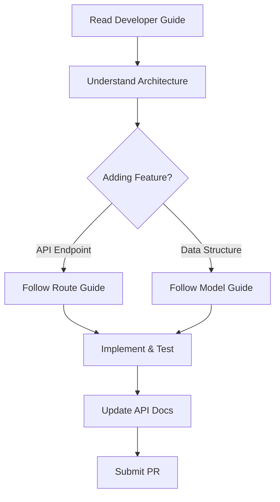

# Documentation Index

Welcome to the Kolosal Server documentation. This directory contains comprehensive guides for developers, operators, and users of the Kolosal Server.

## 📚 Documentation Overview

### For Developers

| Document | Description | Audience |
|----------|-------------|----------|
| [**Developer Guide**](DEVELOPER_GUIDE.md) | Complete development setup, architecture, and workflows | New contributors, maintainers |
| [**Architecture Overview**](ARCHITECTURE.md) | Detailed system architecture and design patterns | Architects, senior developers |
| [**Adding New Routes**](ADDING_ROUTES.md) | Step-by-step guide for implementing API endpoints | Backend developers |
| [**Adding New Models**](ADDING_MODELS.md) | Guide for creating data models and JSON handling | Backend developers |
| [**API Specification**](API_SPECIFICATION.md) | Complete API reference with examples | All developers, integrators |

### For Operations & Deployment

| Document | Description | Audience |
|----------|-------------|----------|
| [**Production Deployment**](PRODUCTION_DEPLOYMENT.md) | Complete production deployment and operations guide | DevOps, system administrators |

### For Users

| Document | Description | Audience |
|----------|-------------|----------|
| [**Main README**](../README.md) | Quick start, features, and basic usage | End users, evaluators |
| [**API Specification**](API_SPECIFICATION.md) | Complete API reference with examples | API consumers |

## 🚀 Quick Start for Developers

1. **First Time Setup**: Start with [Developer Guide](DEVELOPER_GUIDE.md)
2. **Understanding the System**: Read [Architecture Overview](ARCHITECTURE.md)
3. **Adding Features**: Follow [Adding New Routes](ADDING_ROUTES.md) or [Adding New Models](ADDING_MODELS.md)
4. **API Integration**: Reference [API Specification](API_SPECIFICATION.md)
5. **Production Deployment**: Follow [Production Deployment](PRODUCTION_DEPLOYMENT.md)

## 📖 Document Summaries

### Developer Guide
Comprehensive guide covering:
- Development environment setup
- Project structure and conventions
- Core architecture components
- Testing strategies
- Debugging techniques
- Contributing guidelines

### Architecture Overview
Deep dive into system design:
- Component relationships and data flow
- Threading model and concurrency
- Memory management strategies
- Performance characteristics
- Security considerations
- Scaling approaches

### Adding New Routes
Practical guide for API endpoints:
- Route interface and patterns
- Request/response handling
- Error management
- Authentication patterns
- Streaming responses
- Testing strategies

### Adding New Models
Complete data modeling guide:
- Model interface implementation
- JSON serialization/deserialization
- Validation patterns
- Complex nested structures
- Performance optimization
- Testing approaches

### Production Deployment
Complete production operations guide:
- System requirements and setup
- Security configuration
- Performance optimization
- Monitoring and logging
- Scaling strategies
- Troubleshooting procedures

### API Specification
Complete API reference:
- All endpoint specifications
- Request/response formats
- Error codes and handling
- Parameter references
- Usage examples
- OpenAI compatibility details

## 🛠️ Development Workflow

## 📋 Checklists

### New Feature Checklist

- [ ] Read relevant documentation
- [ ] Understand architecture impact
- [ ] Implement following established patterns
- [ ] Add comprehensive tests
- [ ] Update API documentation
- [ ] Add logging and error handling
- [ ] Test integration with existing features
- [ ] Update changelog

### Code Review Checklist

- [ ] Follows coding standards
- [ ] Includes appropriate tests
- [ ] Documentation is updated
- [ ] Error handling is comprehensive
- [ ] Performance impact considered
- [ ] Security implications reviewed
- [ ] API compatibility maintained

## 🤝 Contributing

### Documentation Contributions

We welcome improvements to documentation! Please:

1. **Check existing docs** before creating new ones
2. **Follow the established format** and style
3. **Include practical examples** where possible
4. **Test all code examples** before submitting
5. **Update this index** when adding new documents

### Documentation Standards

- **Format**: Markdown with clear headings
- **Examples**: Include working code examples
- **Language**: Clear, concise, technical writing
- **Structure**: Logical flow with table of contents
- **Links**: Cross-reference related documents

## 🔗 External Resources

### Dependencies Documentation
- [llama.cpp](https://github.com/ggerganov/llama.cpp) - Core inference engine
- [nlohmann/json](https://github.com/nlohmann/json) - JSON library
- [CMake](https://cmake.org/documentation/) - Build system

### Standards and Specifications
- [OpenAI API](https://platform.openai.com/docs/api-reference) - Compatibility reference
- [Server-Sent Events](https://developer.mozilla.org/en-US/docs/Web/API/Server-sent_events) - Streaming protocol
- [JSON Schema](https://json-schema.org/) - Data validation

### Development Tools
- [Visual Studio](https://docs.microsoft.com/en-us/visualstudio/) - IDE documentation
- [Git](https://git-scm.com/doc) - Version control
- [GoogleTest](https://github.com/google/googletest) - Testing framework

## 📞 Getting Help

### For Documentation Issues
- **GitHub Issues**: Report documentation bugs or requests
- **Discussions**: Ask questions about implementation
- **Pull Requests**: Contribute improvements

### For Development Support
- **Architecture Questions**: Reference [Architecture Overview](ARCHITECTURE.md)
- **Implementation Help**: Check [Developer Guide](DEVELOPER_GUIDE.md)
- **API Questions**: See [API Specification](API_SPECIFICATION.md)

## 🔄 Document Maintenance

This documentation is actively maintained. Last updated: June 2025

### Update Schedule
- **Architecture docs**: Updated with major releases
- **API specification**: Updated with each API change
- **Developer guides**: Updated as processes evolve
- **Examples**: Verified with each release

### Version Compatibility
These documents are current for:
- **Kolosal Server**: v1.0.0
- **llama.cpp**: Latest stable
- **API Version**: v1

---

*For the most up-to-date information, always refer to the latest version of these documents in the repository.*
